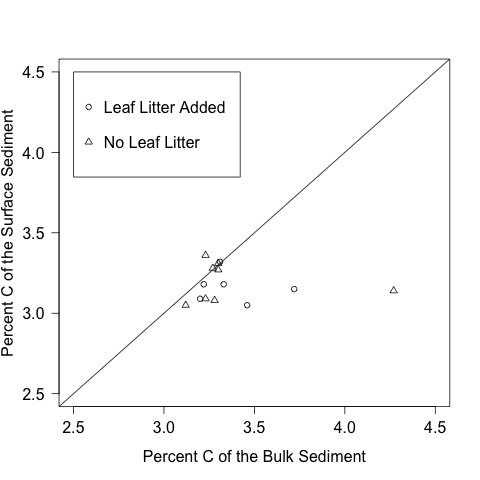

# Analysis of the C:N data for the CPOM Flux Experiment

## Summer 2014

## Metadata

* Code created 2 June 2015 - KF

## Purpose

This code creates calculated variables for the C:N data from the CPOM Flux experiment and evaluates differences in the treatments

## Code
### Import Data

    cn.raw <- read.table("./data/CPOM_Flux_CN_raw.csv", header = T, sep = ",")

### Strip bullshit columns created by Excel

    cn.raw <- cn.raw[, 1:5]

### Replace bad valus from lost sample with `NA`. 

See `CPOM_Flux_CN_raw_metadata.md` for the details, but bulk sample in Vial 13 was mostly lost in shipping so %C and %N are not reliable and are replaced with `NA`

    cn.raw[12, 4:5] <- NA

### Create Calculated Variables

To calculate the actual mass of C and N in the samples I multipled the proportion of C and N (%/100) by the dry mass of the sample

    N.mass <- cn.raw$mass * (cn.raw$percN / 100) # mass of N in the sample in mg
    C.mass <- cn.raw$mass * (cn.raw$percC / 100) # mass of C in the sample in mg

To calculate the C:N I divided the C.mass by the N.mass

    CN <- C.mass / N.mass

### Create labels for the treatments

    CPOM <- c("N", "N", "Y", "N", "Y", "N", "N", "N", "Y", "Y", "Y", "Y", "N", "N", "Y", "Y", "N", "N", "Y", "N", "Y", "N", "N", "N", "Y", "Y", "Y", "Y", "N", "N", "Y", "Y", "Y", "Y", "Y", "Y", "Y", "Y", "Y")

    NUT <- c("Y", "N", "Y", "N", "N", "Y", "N", "N", "Y", "Y", "N", "N", "Y", "Y", "Y", "N", "Y", "N", "Y", "N", "N", "Y", "N", "N", "Y", "Y", "N", "N", "Y", "Y", "Y", "N", "Y", "N", "Y", "Y", "N", "N", "Y") 

### Bind the labels and calculated variables into data file

    cn <- data.frame(cn.raw, N.mass, C.mass, CN, CPOM, NUT)

    write.table(cn, "./data/CPOM_Flux_CN.csv", quote = F, row.names = F, sep = ",")

## Data Analysis

### Load working data
** Begin data reanalysis here with working data **
  
    cn <- read.table("./data/CPOM_Flux_CN.csv", header = T, sep = ",")

### Summary Statistics

#### %C content of the surface sediments

    summary(cn$percC[cn$Source == "surf"])

~~~~
  
Min. 1st Qu.  Median    Mean 3rd Qu.    Max. 
  3.050   3.090   3.180   3.206   3.312   3.410 

~~~~
  
##### Effect of CPOM and Nutrients

    tapply(cn$percC[cn$Source == "surf"], cn$CPOM[cn$Source == "surf"], summary) 

~~~~

$N ** NO CPOM **
   Min. 1st Qu.  Median    Mean 3rd Qu.    Max. 
  3.050   3.088   3.205   3.198   3.288   3.360 

$Y ** CPOM **
   Min. 1st Qu.  Median    Mean 3rd Qu.    Max. 
  3.050   3.135   3.180   3.215   3.325   3.410 

~~~~

    tapply(cn$percC[cn$Source == "surf"], cn$NUT[cn$Source == "surf"], summary)
    
~~~~

$N ** NO Added DIP and DIN **
   Min. 1st Qu.  Median    Mean 3rd Qu.    Max. 
  3.090   3.148   3.225   3.236   3.318   3.410 

$Y ** Added DIP and DIN **
   Min. 1st Qu.  Median    Mean 3rd Qu.    Max. 
  3.050   3.072   3.135   3.176   3.290   3.360 
  
~~~~

  
#### % C in the Bulk sediment

    summary(cn$percC[cn$Source == "bulk"])

~~~~
Percent C in the bulk Sediment 

Min. 1st Qu.  Median    Mean 3rd Qu.    Max.    NAs 
  3.120   3.230   3.290   3.374   3.325   4.270       1

~~~~

##### Effect of CPOM and Nutrients
  
    tapply(cn$percC[cn$Source == "bulk"], cn$CPOM[cn$Source == "bulk"], summary) 

~~~~

$N ** NO CPOM **
   Min. 1st Qu.  Median    Mean 3rd Qu.    Max. 
  3.120   3.230   3.275   3.375   3.300   4.270 

$Y  ** CPOM **
   Min. 1st Qu.  Median    Mean 3rd Qu.    Max.    NAs 
  3.200   3.242   3.320   3.373   3.427   3.720       1 

~~~~

    tapply(cn$percC[cn$Source == "bulk"], cn$NUT[cn$Source == "bulk"], summary)

~~~~
  
$N ** NO Added DIP and DIN **
   Min. 1st Qu.  Median    Mean 3rd Qu.    Max.    NAs 
  3.220   3.247   3.300   3.507   3.615   4.270       1 

$Y ** Added DIP and DIN **
   Min. 1st Qu.  Median    Mean 3rd Qu.    Max. 
  3.120   3.222   3.275   3.275   3.315   3.460

~~~~

### Comparison of Bulk and Surface Sediment % C
Due to the fact that the Bulk samples were missing data from BOD bottle 1, I created a new set of objects `bulk` and `surf` where I remove the BOD 1 observation from the surface observations to align the surface and bulk observations so that they could be compared pairwise.

    surfC <- cn$percC[cn$Source == "surf"]
    surfC <- surfC[-1]

    bulkC <- cn$percC[cn$Source == "bulk"]

    par(las = 1)
    plot(surfC ~ bulkC, ylim = c(2.5, 4.5), xlim = c(2.5, 4.5), subset = cn$CPOM[cn$Source == "bulk"] == "Y", ylab = "Percent C of the Surface Sediment", xlab = "Percent C of the Bulk Sediment")
    points(surfC ~ bulkC, ylim = c(2.5, 4.5), xlim = c(2.5, 4.5), subset = cn$CPOM[cn$Source == "bulk"] == "N", pch = 2)
    abline(0, 1) # 1:1 line for comparison of the variables
    legend(2.5, 4.5, c("Leaf Litter Added", "No Leaf Litter"), pch = c(1, 2))
    dev.copy(jpeg, "./output/plots/percC_bulk_surf_comp.jpg")
    dev.off()

##### Difference between the bulk and surface sediment % C

    summary(bulkC - surfC)

~~~~
difference between bulk %C and surf %C

Min. 1st Qu.  Median    Mean 3rd Qu.    Max.    NAs 
-0.1300  0.0000  0.0900  0.1921  0.1875  1.1300       1

~~~~
  
Correlation of the samples shows that there is limited correlation between the bulk and surface sediments.

    cor(bulk, surf, use = "pairwise.complete.obs")

~~~~
Correlation between the surface and bulk sediment percent C

[1] -0.1168136

~~~~

#### Percent N content of the surface sediments

    tapply(cn$percN[cn$Source == "surf"], cn$CPOM[cn$Source == "surf"], summary) 

~~~~

$N ** NO CPOM **
  Min. 1st Qu.  Median    Mean 3rd Qu.    Max. 
 0.2800  0.2800  0.2950  0.2950  0.3025  0.3200 

$Y ** CPOM **
  Min. 1st Qu.  Median    Mean 3rd Qu.    Max. 
 0.2800  0.2900  0.2900  0.2975  0.3100  0.3200 

~~~~

    tapply(cn$percN[cn$Source == "surf"], cn$NUT[cn$Source == "surf"], summary)
    
~~~~

$N ** No Added DIP and DIN **
   Min. 1st Qu.  Median    Mean 3rd Qu.    Max. 
 0.2800  0.2900  0.2950  0.2975  0.3025  0.3200  

$Y ** Added DIP and DIN **
   Min. 1st Qu.  Median    Mean 3rd Qu.    Max. 
  0.280   0.280   0.290   0.295   0.310   0.320 
  
~~~~

  
#### Percent N in the Bulk sediment

    tapply(cn$percN[cn$Source == "bulk"], cn$CPOM[cn$Source == "bulk"], summary) 

~~~~

$N ** NO CPOM **
  Min. 1st Qu.  Median    Mean 3rd Qu.    Max. 
 0.2900  0.3075  0.3100  0.3175  0.3100  0.4000 

$Y  ** CPOM **
  Min. 1st Qu.  Median    Mean 3rd Qu.    Max.    NAs 
 0.3000  0.3000  0.3050  0.3117  0.3250  0.3300       1 

~~~~

    tapply(cn$percN[cn$Source == "bulk"], cn$NUT[cn$Source == "bulk"], summary)

~~~~
  
$N ** NO Added DIP and DIN **
   Min. 1st Qu.  Median    Mean 3rd Qu.    Max.    NAs 
 0.3000  0.3025  0.3100  0.3250  0.3250  0.4000       1 

$Y ** Added DIP and DIN **
   Min. 1st Qu.  Median    Mean 3rd Qu.    Max. 
 0.2900  0.3000  0.3100  0.3075  0.3100  0.3300 

~~~~

### Comparison of Bulk and Surface Sediment Percent N
Due to the fact that the Bulk samples were missing data from BOD bottle 1, I created a new set of objects `bulk` and `surf` where I remove the BOD 1 observation from the surface observations to align the surface and bulk observations so that they could be compared pairwise.

    surfN <- cn$percN[cn$Source == "surf"]
    surfN <- surfN[-1]

    bulkN <- cn$percN[cn$Source == "bulk"]

    par(las = 1)
    plot(surfN ~ bulkN, ylim = c(.25, .45), xlim = c(.25, .45), subset = cn$CPOM[cn$Source == "bulk"] == "Y", ylab = "Percent N of the Surface Sediment", xlab = "Percent N of the Bulk Sediment")
    points(surfN ~ bulkN, subset = cn$CPOM[cn$Source == "bulk"] == "N", pch = 2)
    abline(0, 1) # 1:1 line for comparison of the variables
    legend(.25, .45, c("Leaf Litter Added", "No Leaf Litter"), pch = c(1, 2))
    dev.copy(jpeg, "./output/plots/percN_bulk_surf_comp.jpg")
    dev.off()

  
Correlation of the samples shows that there is limited correlation between the bulk and surface sediments.

    cor(bulkN, surfN, use = "pairwise.complete.obs")

~~~~
Correlation between the surface and bulk sediment percent N

[1] -0.07858652

~~~~

### C:N Ratios

#### Correlation of %C and %N
  
    cor(cn$percC[cn$Source != "leaf"], cn$percN[cn$Source != "leaf"], use = "pairwise.complete.obs")

~~~~
correlation of %C and %N

[1] 0.9682596

~~~~

    par(las = 1)
    plot(cn$percC[cn$Source != "leaf"], cn$percN[cn$Source != "leaf"], ylab = "Percent N", xlab = "Percent C", ylim = c(0.2, 0.5), xlim = c(2, 5))
    dev.copy(jpeg, "./output/plots/percN_by_percC_sed.jpg")
    dev.off()

  
#### Compare the CN by treatments

    tapply(cn$CN[cn$Source == "surf"], cn$CPOM[cn$Source == "surf"], summary) 

~~~~
  
$N ** NO CPOM **
   Min. 1st Qu.  Median    Mean 3rd Qu.    Max. 
  10.50   10.77   10.90   10.85   11.01   11.04 

$Y ** CPOM **
   Min. 1st Qu.  Median    Mean 3rd Qu.    Max. 
  10.66   10.70   10.82   10.81   10.91   10.97 

~~~~

    tapply(cn$CN[cn$Source == "surf"], cn$NUT[cn$Source == "surf"], summary)

~~~~
  
$N **NO Nutrient Addition**
   Min. 1st Qu.  Median    Mean 3rd Qu.    Max. 
  10.66   10.81   10.88   10.88   10.98   11.04 

$Y **Nutrient Addition**
   Min. 1st Qu.  Median    Mean 3rd Qu.    Max. 
  10.50   10.64   10.80   10.77   10.91   11.00 

~~~~

    tapply(cn$CN[cn$CPOM == "Y"], cn$Source[cn$CPOM == "Y"], summary)

~~~~
  
$bulk
   Min. 1st Qu.  Median    Mean 3rd Qu.    Max.    NAs 
  10.48   10.68   10.74   10.82   10.96   11.27       1 

$leaf
   Min. 1st Qu.  Median    Mean 3rd Qu.    Max. 
  15.22   15.84   16.16   16.37   17.15   17.36 

$surf
   Min. 1st Qu.  Median    Mean 3rd Qu.    Max. 
  10.66   10.70   10.82   10.81   10.91   10.97 

~~~~

## Conclusions 
  
Neither nutrients or the addition of leaf litter had an effect on the sediment C:N.  Further, at the end of the experiment, the added leaf litter had a C:N 51.2% greater than the surface sediment. 

    mean(cn$CN[cn$Source == "leaf"]) 

`= 16.36817 # mean C:N of the leaf discs`

    mean(cn$CN[cn$Source == "surf"])

`= 10.82821 # mean C:N of the surface sediment`

    ((16.36817 - 10.82821) / 10.82821) * 100

` = 51.2%`
     
