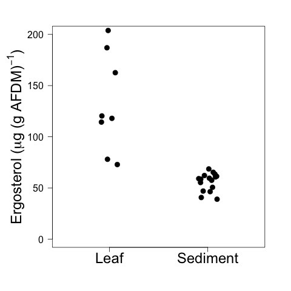
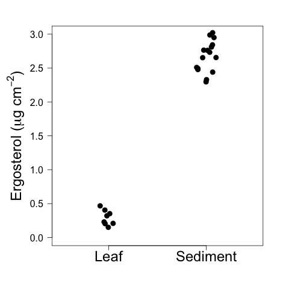

# Analysis of the Ergosterol Data from the CPOM Flux Experiment

## Modified

* 17 May 2016 - KF - adjusted the calculations of the leaf surface area to only use one surface based on Vlads recommendtion, prepped figures for SFS talk
* 1 Nov 2016 - KF - added ANOVA analysis of the leaf and nutrient effects for the ms

## Import Data

    ergo <- read.table("./data/CPOM_Flux_Ergo.csv", header = T, sep = ",")

## Calculate Variables
    
Given that the sediments have a lot of volume that does not likely support fungi, I am converting the ergosterol and fungal biomass to an areal estimate.
    
### Calculate the area of the sediment core and leaf disks
    
    sed.area <- pi * ((0.8 / 2)^2) # sediment core = 0.8 cm diam. Units = cm^2

The surface area of the leaf discs is NOT multipled by 2 so colonization is assumed to only occur on the upper surface of the leaf.
    
    leaf.area <- (pi * ((1 / 2)^2)) * 4 # leaf discs 1 cm diam and each sample = 4 leaf discs.  Units = cm^2

    surf.area <- rep(NA, 32) # create empty object
    # fill in appropriate areas
    surf.area[ergo$samp == "leaf"] <- leaf.area
    surf.area[ergo$samp == "sed"] <- sed.area
    
### Calculate the Areal abundance of ergosterol 

    ergo.area <- ergo$ergo_samp / surf.area

## Calculated Variable Descriptions
    
* surf.area = the surface area of the total sample material in the vial. For the sediment core it is the surface area of the sediment core in cm^2. For the leaf discs it is the surface area of only one side of the 4 leaf discs in cm^2.
    
* ergo.area = the mass of ergosterol per cm^2 of sediment or leaf disc in the sample (&mu;g / cm^2).
    
## Analysis
    
### Ergosterol Normalized by AFDM
    
For the leaf samples (&mu;g ergosterol / g AFDM):
     
    summary(ergo$ergo_per_OM[ergo$samp == "leaf"])
    sd(ergo$ergo_per_OM[ergo$samp == "leaf"], na.rm = T)    
~~~~

 Min. 1st Qu.  Median    Mean 3rd Qu.    Max.    SD           NAs 
  72.88  105.30  119.20  132.10  168.70  203.80  48.04965     8 
    
~~~~
     
For the sediment samples (&mu;g ergosterol / g AFDM):
     
    summary(ergo$ergo_per_OM[ergo$samp == "sed"])
    sd(ergo$ergo_per_OM[ergo$samp == "sed"], na.rm = T)    
~~~~
     
Min. 1st Qu.  Median    Mean 3rd Qu.    Max.     SD 
  39.02   49.71   58.87   55.97   61.60   68.56  8.746507 
    
~~~~

##### Effect of Leaf vs Sediment Substrate
 
    kruskal.test(ergo_per_OM ~ samp, data = ergo)

~~~~
# KS results for leaf vs sediment OM normalized ergo conc.

 Kruskal-Wallis rank sum test

data:  ergo_per_OM by samp
Kruskal-Wallis chi-squared = 15.36, df = 1, p-value = 8.885e-05

~~~~

##### Plot of OM normalized Ergo by Substrate
 
    # points plot
    par(las = 1, mar=c(5, 6, 3, 3))
    plot(ergo_per_OM ~ jitter(as.numeric(samp), 0.5), data = ergo, xlim = c(0.5, 2.5), ylim = c(0, 200), ylab = expression(paste("Ergosterol (", mu, "g (g AFDM)"^{-1}, ")")), xlab = " ", axes = F, cex = 1.5, cex.lab = 1.5, pch = 19)
    axis(2, cex.axis = 1.0)
    axis(1, at = c(1, 2), c("Leaf", "Sediment"), cex.axis = 1.5)
    box()
    dev.copy(jpeg, "./output/plots/ergo_per_OM_by_samp.jpg")
    dev.off()
    

    
#### Analysis of Leaf and Nutrient Effects
##### Analysis of Nutrient Effects on Leaf Erg
 
    anova(lm(ergo_per_OM ~ nutrients, data = ergo, subset = samp == "leaf"))

~~~~
# ANOVA Results of Nutrient Effect on OM normalized leaf Ergo
 
Analysis of Variance Table

Response: ergo_per_OM
          Df  Sum Sq Mean Sq F value Pr(>F)
nutrients  1    62.4   62.44  0.0233 0.8838
Residuals  6 16098.9 2683.16      

~~~~
 
##### Effect of Leaf and Nutrient Effect on Sed
 
    anova(lm(ergo_per_OM ~ CPOM * nutrients, data = ergo, subset = samp == "sed"))

~~~~
# ANOVA Reuslts of Nutrient and CPOM effect on sediment ergo conc.
 
Analysis of Variance Table

Response: ergo_per_OM
               Df  Sum Sq Mean Sq F value Pr(>F)
CPOM            1   35.41  35.414  0.4164 0.5309
nutrients       1   32.27  32.268  0.3794 0.5494
CPOM:nutrients  1   59.29  59.294  0.6972 0.4200
Residuals      12 1020.54  85.045 

~~~~~

Analyzed in this way the, leaves appear to have more ergosterol than the sediments but since the sediments were a core there is a lot of AFDM that was below the sediment surface that could not have supported fungal biomass.  Thus the value for the sediments is being diluted by this excess sediment organic matter.
    
If we normalize the samples by area, we can see that the sediments actually have a lot more ergosterol than the leaf discs.

### Ergosterol Normalized by Area
    
For the leaf samples (&mu;g ergosterol / cm^2 leaf):
    
    summary(ergo.area[ergo$samp == "leaf"])
    sd(ergo.area[ergo$samp == "leaf"], na.rm = T)

~~~~
     
 Min. 1st Qu.  Median    Mean 3rd Qu.    Max.    SD            NAs 
 0.1502  0.2075  0.2751  0.2921  0.3651  0.4671  0.1110689     8 

~~~~
     
For the sediment samples (&mu;g ergosterol / cm^2 sediments):
     
     summary(ergo.area[ergo$samp == "sed"])
     sd(ergo.area[ergo$samp == "sed"], na.rm = T)

~~~~
     
Min. 1st Qu.  Median    Mean 3rd Qu.    Max.     SD
  2.296   2.489   2.694   2.670   2.818   3.021  0.2275911
    
~~~~
    
#### Kruskal Test of difference between the medians
    
    kruskal.test(ergo.area ~ samp, data = ergo)
    
~~~~
   
Kruskal-Wallis rank sum test

data:  ergo.area by samp
Kruskal-Wallis chi-squared = 15.36, df = 1, p-value = 8.885e-05

~~~~

##### Plot of Area Normalized Ergo by Substrate
 
    # points plot
    par(las = 1, mar=c(5, 6, 3, 3))
    plot(ergo.area ~ jitter(as.numeric(samp), 0.5), data = ergo, xlim = c(0.5, 2.5), ylim = c(0, 3), ylab = expression(paste("Ergosterol (", mu, "g cm"^{-2}, ")")), xlab = " ", axes = F, cex = 1.5, cex.lab = 1.5, pch = 19)
    axis(2, cex.axis = 1.0)
    axis(1, at = c(1, 2), c("Leaf", "Sediment"), cex.axis = 1.5)
    box()
    dev.copy(jpeg, "./output/plots/ergo_per_cm2.jpg")
    dev.off()

    
     
### Effect of Leaves and Nutrients on Sediment Ergosterol

#### Analysis of Nutrients on Leaf Area-normalized Ergo

    anova(lm(ergo.area ~ nutrients, data = ergo, subset = samp == "leaf"))

~~~~
# ANOVA Results of Nutrient Effect on Area-normalized leaf Ergo
 
Analysis of Variance Table

Response: ergo.area
          Df   Sum Sq   Mean Sq F value Pr(>F)
nutrients  1 0.002008 0.0020076  0.1428 0.7185
Residuals  6 0.084346 0.0140577      

~~~~~
 
#### Analysis of Leaf and Nutrient Effect

    anova(lm(ergo.area ~ CPOM * nutrients, data = ergo, subset = samp == "sed"))

~~~~
# ANOVA Results of Effect of Leaf and Nutrients on Area Normalized Ergo
 
Analysis of Variance Table

Response: ergo.area
               Df  Sum Sq  Mean Sq F value Pr(>F)
CPOM            1 0.04877 0.048772  0.9643 0.3455
nutrients       1 0.00093 0.000928  0.0183 0.8945
CPOM:nutrients  1 0.12031 0.120309  2.3786 0.1490
Residuals      12 0.60696 0.050580  

~~~~
 
 
##### Plot of Leaf and Nutrient Effect on Area-normalized Sediment Ergo    
    par(las = 1)
    plot(ergo.area ~ jitter(as.numeric(CPOM), 1), data = ergo, subset = samp == "sed" & nutrients == "N", ylim = c(0, 3), xlim = c(0, 3), axes = F, xlab = " ", ylab = "Sediment Ergosterol / cm^2")
    points(ergo.area ~ jitter(as.numeric(CPOM), 1), data = ergo, subset = samp == "sed" & nutrients != "N", pch = 19)
    axis(2)
    axis(1, at = c(1, 2), c("No Leaves", "Leaves"))
    legend(0, 1, c("Ambient Nutrients", "Added Nutrients"), pch = c(1, 19))
    box()
    dev.copy(jpeg, "./output/plots/sed_erg_by_CPOM.jpg")
    dev.off()
    

# Manuscript Plot

    par(las = 1, mar = c(5, 5, 2, 2))
    plot(ergo.area ~ jitter(as.numeric(CPOM), 1), data = ergo, subset = samp == "sed" & nutrients == "N", ylim = c(0, 3), xlim = c(0.5, 2.5), axes = F, xlab = " ", ylab = expression(paste("Ergosterol (",mu, "g cm"^{-2}, ")")), cex = 1.5, cex.lab = 1.2, cex.axis = 1.5)
    points(ergo.area ~ jitter(as.numeric(CPOM), 1), data = ergo, subset = samp == "sed" & nutrients != "N", pch = 19, cex = 1.5)
    points(ergo.area ~ jitter(as.numeric(CPOM), 1), data = ergo, subset = samp == "leaf" & nutrients == "N", pch = 2, cex = 1.5) 
    points(ergo.area ~ jitter(as.numeric(CPOM), 1), data = ergo, subset = samp == "leaf" & nutrients != "N", pch = 17, cex = 1.5) 
    axis(2)
    axis(1, at = c(1, 2), c("No Leaf Litter", "Leaf Litter"))
    #legend(0, 1, c("Ambient Nutrients", "Added Nutrients"), pch = c(1, 19))
    box()
    dev.copy(jpeg, "./output/plots/area_erg_by_CPOM_nut.jpg")
    dev.off()
    

 