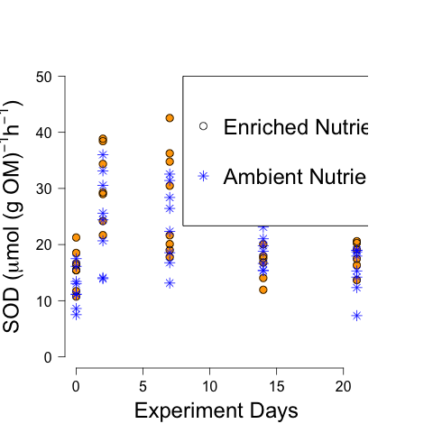

# Analysis of the SOD results from the CPOM Flux Experiment - Summer 2014

## Metadata

Code created: Summer 2014

Modified:

* 9 June 2015 - KF - changed the values in `CPOM_flux_bottleOM_initial.csv` to match the latest values calculated in `CPOM_Flux_Exp_BOD_OM_Analysis.md`. Also removed all of the analysis that is not redundant with `CPOM_Flux_SOD_Analysis`.

## Purpose

This code it to analyze the SOD data from the treatments with and without CPOM and/or nutrients

## Import data

    sod10 <- read.table("./data/sod_calculation_10jun2014.csv", header = T, sep = ",")
    sod12 <- read.table("./data/sod_calculation_12jun2014.csv", header = T, sep = ",")
    sod17 <- read.table("./data/sod_calculation_17jun2014.csv", header = T, sep = ",")
    sod24 <- read.table("./data/sod_calculation_24jun2014.csv", header = T, sep = ",")
    sod01 <- read.table("./data/sod_calculation_1jul2014.csv", header = T, sep = ",")
    botOM <- read.table("./data/CPOM_flux_bottleOM_initial.csv", header = T, sep = ",")

## Data Analysis

## 10 June 2014 Run

### Merge sediment OM calculation to SOD

    sod10 <- merge(sod10, botOM, by.x = "CPOM", by.y = "CPOM")

### Normalize flux to sediment OM and time

    mmol.h10 <- sod10$dDO / sod10$incubation.h
    mmol.h.OM10 <- mmol.h10 / sod10$tot.OM
    ## convert to umol to make easier to read
    umol.h.OM10 <- mmol.h.OM10 * 1000

### Summarize OM normalized Data

    summary(umol.h.OM10)

~~~~

    summary(umol.h.OM10)
  Min. 1st Qu.  Median    Mean 3rd Qu.    Max. 
 0.3128  0.4647  0.6007  0.5845  0.6842  0.8858 

~~~~

    stem(umol.h.OM10)

~~~~

The decimal point is 1 digit(s) to the left of the |

  2 | 16
  4 | 567946
  6 | 4478937
  8 | 9

~~~~

### Summarize Area Normalized Data

    summary(sod10$SOD)

~~~~

 Min. 1st Qu.  Median    Mean 3rd Qu.    Max. 
 0.3650  0.5424  0.7057  0.6878  0.8097  1.0480

~~~~

    stem(sod10$SOD)

~~~~

The decimal point is 1 digit(s) to the left of the |

   2 | 7
   4 | 22447
   6 | 4656
   8 | 01260
  10 | 5

~~~~

################################################################################

## 12 June 2014 Run

### Merge sediment OM calculation to SOD

    sod12 <- merge(sod12, botOM, by.x = "CPOM", by.y = "CPOM")

### Normalize flux to sediment OM and time

    mmol.h12 <- sod12$dDO / sod12$incubation.h
    mmol.h.OM12 <- mmol.h12 / sod12$tot.OM
    ## convert to umol to make easier to read
    umol.h.OM12 <- mmol.h.OM12 * 1000

### Summarize OM normalized Data

    summary(umol.h.OM12)

~~~~

    summary(umol.h.OM12)
    Min. 1st Qu.  Median    Mean 3rd Qu.    Max.    NAs 
 0.5800  0.9559  1.2080  1.1500  1.4060  1.6190       1 

~~~~

    stem(umol.h.OM12)

~~~~

The decimal point is at the |

  0 | 6699
  1 | 00122344
  1 | 566

~~~~

### Summarize Area Normalized Data

    summary(sod12$SOD)

~~~~

    summary(sod12$SOD)
   Min. 1st Qu.  Median    Mean 3rd Qu.    Max.    NAs 
  0.677   1.116   1.430   1.354   1.664   1.895   1.000

~~~~

    stem(sod12$SOD)

~~~~

The decimal point is at the |

  0 | 77
  1 | 0122244
  1 | 567899

~~~~

################################################################################

## 17 June 2014 Run

### Merge sediment OM calculation to SOD

    sod17 <- merge(sod17, botOM, by.x = "CPOM", by.y = "CPOM")

### Normalize flux to sediment OM and time

    mmol.h17 <- sod17$dDO / sod17$incubation.h
    mmol.h.OM17 <- mmol.h17 / sod17$tot.OM
    ## convert to umol to make easier to read
    umol.h.OM17 <- mmol.h.OM17 * 1000

### Summarize OM normalized Data

    summary(umol.h.OM17)

~~~~

    Min. 1st Qu.  Median    Mean 3rd Qu.    Max. 
 0.5474  0.7874  1.0160  1.0730  1.3210  1.7730 

~~~~

    stem(umol.h.OM17)

~~~~

  The decimal point is at the |

  0 | 57788899
  1 | 123344
  1 | 58

~~~~

### Summarize Area Normalized Data

    summary(sod17$SOD)

~~~~

    summary(sod17$SOD)
   Min. 1st Qu.  Median    Mean 3rd Qu.    Max. 
 0.6389  0.9190  1.1950  1.2640  1.5630  2.0980

~~~~

    stem(sod17$SOD)

~~~~

  The decimal point is at the |

  0 | 68999
  1 | 01134
  1 | 55678
  2 | 1

~~~~

################################################################################

## 24 June 2014 Run

### Merge sediment OM calculation to SOD

    sod24 <- merge(sod24, botOM, by.x = "CPOM", by.y = "CPOM")

### Normalize flux to sediment OM and time

    mmol.h24 <- sod24$dDO / sod24$incubation.h
    mmol.h.OM24 <- mmol.h24 / sod24$tot.OM
    ## convert to umol to make easier to read
    umol.h.OM24 <- mmol.h.OM24 * 1000

### Summarize OM normalized Data

    summary(umol.h.OM24)

~~~~

summary(umol.h.OM24)
   Min. 1st Qu.  Median    Mean 3rd Qu.    Max. 
0.4976  0.6799  0.7662  0.7954  0.8978  1.1940 

~~~~

    stem(umol.h.OM24)

~~~~

The decimal point is 1 digit(s) to the left of the |

   4 | 09
   6 | 4490358
   8 | 2486
  10 | 019

~~~~

### Summarize Area Normalized Data

    summary(sod24$SOD)

~~~~

summary(sod24$SOD)
   Min. 1st Qu.  Median    Mean 3rd Qu.    Max. 
 0.5808  0.7935  0.8942  0.9360  1.0630  1.4130 

~~~~

    stem(sod24$SOD)

~~~~

The decimal point is 1 digit(s) to the left of the |

   4 | 8
   6 | 855
   8 | 1277189
  10 | 449
  12 | 0
  14 | 1

~~~~

################################################################################

## 1 July 2014 Run

### Merge sediment OM calculation to SOD

    sod01 <- merge(sod01, botOM, by.x = "CPOM", by.y = "CPOM")

### Normalize flux to sediment OM and time

    mmol.h01 <- sod01$dDO / sod01$incubation.h
    mmol.h.OM01 <- mmol.h01 / sod01$tot.OM
    ## convert to umol to make easier to read
    umol.h.OM01 <- mmol.h.OM01 * 1000

### Summarize OM normalized Data

    summary(umol.h.OM01)

~~~~

    summary(umol.h.OM01)
   Min. 1st Qu.  Median    Mean 3rd Qu.    Max. 
0.3056  0.6264  0.7637  0.7479  0.8082  1.2050 

~~~~

    stem(umol.h.OM01)

~~~~

The decimal point is 1 digit(s) to the left of the |

   2 | 1
   4 | 179
   6 | 4835899
   8 | 046
  10 | 3
  12 | 1

~~~~

### Summarize Area Normalized Data

    summary(sod01$SOD)

~~~~

   Min. 1st Qu.  Median    Mean 3rd Qu.    Max. 
 0.3567  0.7389  0.8974  0.8788  0.9565  1.4070

~~~~

    stem(sod01$SOD)

~~~~

The decimal point is at the |

  0 | 4
  0 | 67788899999
  1 | 0034

~~~~

################################################################################

## Combine All Dates

### Average OM normalized SOD

    sum.OMflux <- umol.h.OM10 + umol.h.OM12 + umol.h.OM17 + umol.h.OM24 + umol.h.OM01
    mean.OMflux <- sum.OMflux / 5

### Average OM normalized SOD

    sum.Aflux <- sod10$SOD + sod12$SOD + sod17$SOD + sod24$SOD + sod01$SOD
    mean.Aflux <- sum.Aflux / 5

### Areal SOD by Time

#### Bind all dates

    sod.tot <- rbind(sod10, sod12, sod17, sod24, sod01)
    date <- c(rep("2014-06-10", 16), rep("2014-06-12", 16), rep("2014-06-17", 16), rep("2014-06-24", 16), rep("2014-07-01", 16))
    sod.tot <- data.frame(date, sod.tot)

#### Determine days elapsed

    days10 <- as.numeric(difftime(sod.tot$date[sod.tot$date == "2014-06-10"], sod.tot$date[sod.tot$date == "2014-06-10"], units = "days"))
    days12 <- as.numeric(difftime(sod.tot$date[sod.tot$date == "2014-06-12"], sod.tot$date[sod.tot$date == "2014-06-10"], units = "days"))
    days17 <- as.numeric(difftime(sod.tot$date[sod.tot$date == "2014-06-17"], sod.tot$date[sod.tot$date == "2014-06-10"], units = "days"))
    days24 <- as.numeric(difftime(sod.tot$date[sod.tot$date == "2014-06-24"], sod.tot$date[sod.tot$date == "2014-06-10"], units = "days"))
    days01 <- as.numeric(difftime(sod.tot$date[sod.tot$date == "2014-07-01"], sod.tot$date[sod.tot$date == "2014-06-10"], units = "days"))
    days.elap <- c(days10, days12, days17, days24, days01)

    sod.tot <- data.frame(sod.tot, days.elap)

##### Output

    unique(days.elap)
   
    > unique(days.elap)
    [1]  0  2  7 14 21

#### Analyize OM normalized SOD by time

##### create OM normalized variable

    sod.OM.bot <- sod.tot$dDO/sod.tot$tot.OM
    sod.OM.h <- sod.OM.bot/sod.tot$incubation.h
    sod.OM.mmol <- sod.OM.h * 24
    sod.OM <- sod.OM.mmol * 1000 # flux in umol O2 / g OM / d

    par(mar = c(5, 5, 5, 5))
    plot(sod.OM ~ days.elap, data = sod.tot, subset = CPOM == "yes", pch = 19, ylim = c(0, 50), ylab = expression(paste("SOD (", mu,"mol (g OM)"^{-1}, "h"^{-1}, ")")), xlab = "Experiment Days", cex.lab = 1.5, axes = F, cex = 1.5, col = "light green")
    points(sod.OM ~ days.elap, data = sod.tot, subset = CPOM == "yes", pch = 1, cex = 1.5)
    axis(1, las = 1, cex = 1.5)
    axis(2, las = 2, cex = 1.5)
    points(sod.OM ~ days.elap, data = sod.tot, subset = CPOM == "no", pch = 8, cex = 1.5, col = "blue")
    legend(8, 50, c("Leaf Litter ", "No-Leaf Litter "), pch = c(19, 8), col = c("light green", "blue"), cex = 1.5)
    legend(8, 50, c("Leaf Litter ", "No-Leaf Litter "), pch = c(1, 8), col = c("black", "blue"), cex = 1.5)
    dev.copy(png, "./output/plots/CPOM_flux_OMflux_by_date.png")
    dev.off()
    dev.copy(pdf, "./output/plots/CPOM_flux_OMflux_by_date.pdf")
    dev.off()

_OM normalized SOD by Date_

    par(mar = c(5, 5, 5, 5))
    plot(sod.OM ~ days.elap, data = sod.tot, subset = nutrient == "yes", pch = 19, ylim = c(0, 50), ylab = expression(paste("SOD (", mu,"mol (g OM)"^{-1}, "h"^{-1}, ")")), xlab = "Experiment Days", cex.lab = 1.5, axes = F, cex = 1.5, col = "orange")
    points(sod.OM ~ days.elap, data = sod.tot, subset = nutrient == "yes", pch = 1, cex = 1.5)
    axis(1, las = 1, cex = 1.5)
    axis(2, las = 2, cex = 1.5)
    points(sod.OM ~ days.elap, data = sod.tot, subset = nutrient == "no", pch = 8, cex = 1.5, col = "blue")
    legend(8, 50, c("Enriched Nutrients ", "Ambient Nutrients "), pch = c(19, 8), col = c("orange", "blue"), cex = 1.5)
    legend(8, 50, c("Enriched Nutrients ", "Ambient Nutrients "), pch = c(1, 8), col = c("black", "blue"), cex = 1.5)
    dev.copy(png, "./output/plots/nutrient_flux_OMflux_by_date.png")
    dev.off()
    dev.copy(pdf, "./output/plots/nutrient_flux_OMflux_by_date.pdf")
    dev.off()

_OM SOD by Date with Nutrients_

## Create data file of total SOD data including sod.OM

    sod.tot <- data.frame(sod.tot, sod.OM)
    write.table(sod.tot, "./data/CPOM_Flux_SOD.csv", quote = F, row.names = F, sep = ",")
