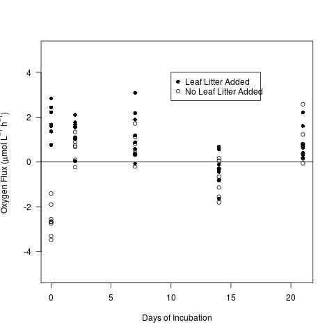
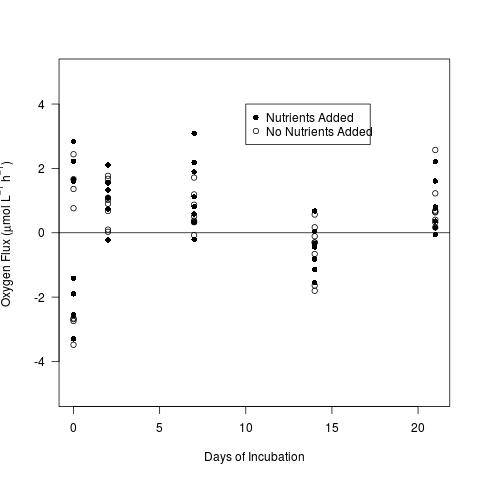

# Analysis of the Water Respiration results from the CPOM Flux Experiment - Summer 2014

## Metadata

Code created: 25 June 2015 - KF

Modified:

* 3 June 2015 - KF - added calculated water R from 2 Jul 2014 run

* 11 June 2015 - KF - added code for display of figures

* 22 March 2016 - KF - calculated the areal oxygen consumption

## Purpose

This code it to analyze the water R data from the treatments with and without CPOM and/or nutrients

## Import data

    wR11 <- read.table("./data/waterR_calculation_11jun2014.csv", header = T, sep = ",")
    wR13 <- read.table("./data/waterR_calculation_13jun2014.csv", header = T, sep = ",")
    wR18 <- read.table("./data/waterR_calculation_18jun2014.csv", header = T, sep = ",")
    wR25 <- read.table("./data/waterR_calculation_25jun2014.csv", header = T, sep = ",")
    wR2 <- read.table("./data/waterR_calculation_2jul2014.csv", header = T, sep = ",")

## Data Analysis

### Combine all of the dates together into a single data.frame

    wR.tot <- rbind(wR11, wR13, wR18, wR25, wR2)
    date <- c(rep("2014-06-11", 16), rep("2014-06-13", 16), rep("2014-06-18", 16), rep("2014-06-25", 16), rep("2014-07-02", 16))

the elapsed days were calculated in `CPOM_Flux_Exp_SOD_flux_calc.md` so I used the results here

    days.elap <- c(rep(0, 16), rep(2, 16), rep(7, 16), rep(14, 16), rep(21, 16))
    wR.tot <- data.frame(wR.tot, date, days.elap)

### Create data file with these final modifications
  
    write.table(wR.tot, "./data/CPOM_Flux_waterR.csv", quote = F, row.names = F, sep = ",")

** Use these data for all re-analyses**

    wR.tot <- read.table("./data/CPOM_Flux_waterR.csv", header = T, sep = ",")

### Summary Statistics

Summary of the water oxygen flux (mmol O2 / L / h) for all the samples 

     summary(wR.tot$waterR)

~~~~

      Min.    1st Qu.     Median       Mean    3rd Qu.       Max.       NAs 
-0.0034800 -0.0002137  0.0005853  0.0003695  0.0012790  0.0030920          1

~~~~

     stem(wR.tot$waterR)

~~~~
  
The decimal point is 3 digit(s) to the left of the |

  -3 | 53
  -2 | 7776
  -1 | 986541
  -0 | 887433322111
   0 | 00122233334445666777778888899
   1 | 011122345666777789
   2 | 1222468
   3 | 1

~~~~

Summary Statistics for water R (umol O2/L/h) by days elapsed in the CPOM treatment
  
    tapply(wR.tot$waterR[wR.tot$CPOM == "yes"]*1000, wR.tot$days.elap[wR.tot$CPOM == "yes"], summary)

~~~~
  
$`0`
   Min. 1st Qu.  Median    Mean 3rd Qu.    Max. 
 0.7638  1.5330  1.6580  1.8170  2.2780  2.8390 

$`2`
   Min. 1st Qu.  Median    Mean 3rd Qu.    Max. 
0.03243 1.06900 1.55800 1.35100 1.70000 2.10600 

$`7`
    Min.  1st Qu.   Median     Mean  3rd Qu.     Max. 
-0.07413  0.52160  1.03300  1.26000  1.96600  3.09200 

$`14`
    Min.  1st Qu.   Median     Mean  3rd Qu.     Max. 
-1.63900 -0.53620 -0.31430 -0.29940  0.06094  0.67620 

$`21`
   Min. 1st Qu.  Median    Mean 3rd Qu.    Max. 
 0.1521  0.3848  0.6440  0.8453  0.9804  2.2130 

~~~~
  
Summary Statistics for water R (umol O2/L/h) in the NO CPOM treatment

    tapply(wR.tot$waterR[wR.tot$CPOM == "no"]*1000, wR.tot$days.elap[wR.tot$CPOM == "no"], summary)

~~~~

$`0`
   Min. 1st Qu.  Median    Mean 3rd Qu.    Max. 
 -3.480  -2.879  -2.673  -2.591  -2.391  -1.412 

$`2`
   Min. 1st Qu.  Median    Mean 3rd Qu.    Max.    NAs 
-0.2270  0.3880  0.7362  0.6587  0.9968  1.3320       1 

$`7`
   Min. 1st Qu.  Median    Mean 3rd Qu.    Max. 
-0.2005  0.3322  0.4459  0.6247  0.8882  1.7150 

$`14`
   Min. 1st Qu.  Median    Mean 3rd Qu.    Max. 
-1.8020 -1.2420 -0.7329 -0.7544 -0.2112  0.1708 

$`21`
    Min.  1st Qu.   Median     Mean  3rd Qu.     Max. 
-0.05817  0.31540  0.74120  0.81990  0.90830  2.57400 

~~~~
  

### Preliminary Plots

Plot of the water R by CPOM

     par(las = 1)
     plot(waterR*1000 ~ days.elap, data = wR.tot, subset = CPOM == "yes", ylim = c(-5, 5), pch = 16, ylab = expression(paste("Oxygen Flux (", mu, "mol L"^{-1}, " h"^{-1}, ") " )), xlab = "Days of Incubation")
     points(waterR*1000 ~ days.elap, data = wR.tot, subset = CPOM == "no")
     abline(h = 0)
     legend(10, 4, c("Leaf Litter Added", "No Leaf Litter Added"), pch = c(16, 1))
     dev.copy(jpeg, "./output/plots/waterR_by_CPOM.jpg")
     dev.off()

     
Plot of the water R by nutrient

     par(las = 1)
     plot(waterR*1000 ~ days.elap, data = wR.tot, subset = nutrient == "yes", ylim = c(-5, 5), pch = 16, ylab = expression(paste("Oxygen Flux (", mu, "mol L"^{-1}, " h"^{-1}, ") " )), xlab = "Days of Incubation")
     points(waterR*1000 ~ days.elap, data = wR.tot, subset = nutrient == "no")
     abline(h = 0)
     legend(10, 4, c("Nutrients Added", "No Nutrients Added"), pch = c(16, 1))
     dev.copy(jpeg, "./output/plots/waterR_by_NUT.jpg")
     dev.off()

# Calculation of the Areal Flux from the Water

Each of the bottles received 100 ml of slurry and the BOD bottle are nominally 300 ml so each bottle should have approximately 200 ml of overlying water. This is likely a slight underestimate, since the sediments settled during the experiment. 

If we assume these volumes are correct then the mass (mmol) of oxygen consumed per hour in the bottles would be:
 
    dDO.mass.h <- wR.tot$waterR * 200 # mmol O2 / bottle / h

This mass can then be converted to an areal measure (mmol O2/ m2 / h) by multiplying by the sediment area of the bottle (0.0028 m2):
 
    waterR.m2.h <- dDO.mass.h * 0.0028 # mmol O2 / m2 / h

## Summary 

    summary(waterR.m2.h)

~~~~
Areal Oxygen Consumption of the Water (mmol O2 / m2 / h)

      Min.    1st Qu.     Median       Mean    3rd Qu.       Max.       NAs 
-0.0019490 -0.0001197  0.0003278  0.0002069  0.0007163  0.0017310          1 

~~~~
 
    stem(waterR.m2.h) 

~~~~
Areal Oxygen Consumption of the Water (mmol O2 / m2 / h)

  The decimal point is 3 digit(s) to the left of the |

  -1 | 98555
  -1 | 410
  -0 | 998655
  -0 | 4222211100
   0 | 00111122222223334444444444
   0 | 555666677789999999
   1 | 001222244
   1 | 67

~~~~
 
 
 