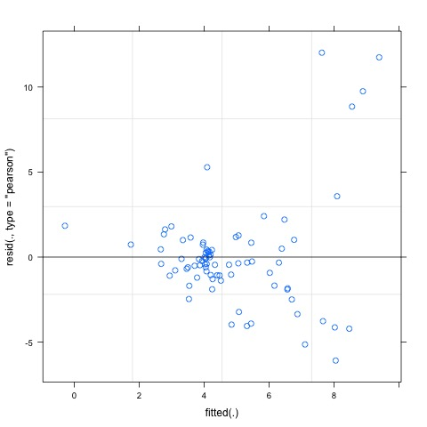
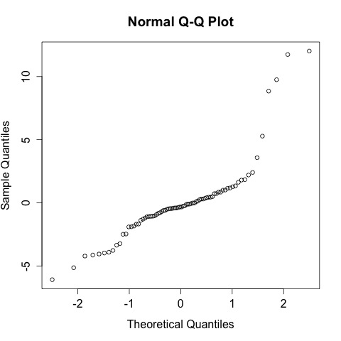
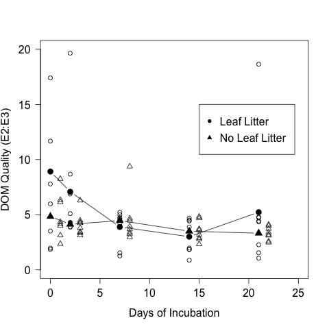
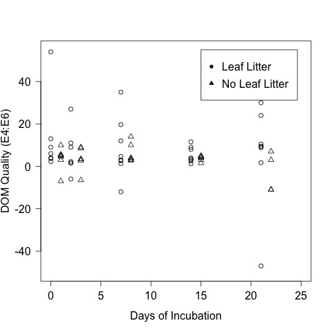
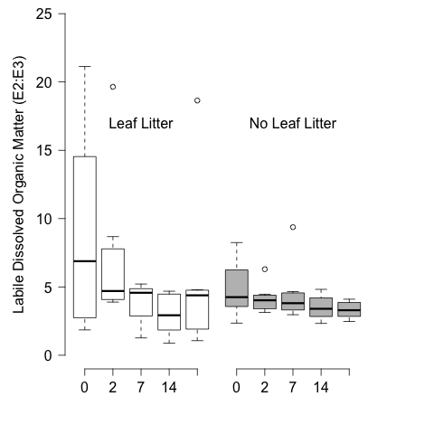

# Analysis of the spec scan results from the CPOM Flux Experiment - Summer 2014

## Purpose

This code it to analyze the spec scan data from the treatments with and without CPOM and/or nutrients

## Load Data

    Eratio <- read.table("./data/CPOM_Flux_Eratio.csv", header = T, sep = ",")

## Statistical Summary

Summary of the E2:E3 in all of the samples on all days

    summary(Eratio$E2E3)

~~~~

Min. 1st Qu.  Median    Mean 3rd Qu.    Max. 
 0.8743  3.1410  4.0500  4.8380  4.7340 21.1400 
  
~~~~

### Repeated Measures Analysis
  
Requires the `lmerTest` package

    library("lmerTest", lib.loc="~/Library/R/3.1/library")

#### Specify the formula

    E2E3.mod <- lmer(E2E3 ~ 1 + elapsed.d * CPOM * nutrient + (1 + elapsed.d|bod), Eratio)
    summary(E2E3.mod)

~~~~
  
Linear mixed model fit by REML t-tests use Satterthwaite approximations to degrees of
  freedom [merModLmerTest]
Formula: E2E3 ~ 1 + elapsed.d * CPOM * nutrient + (1 + elapsed.d | bod)
   Data: Eratio

REML criterion at convergence: 429.2

Scaled residuals: 
    Min      1Q  Median      3Q     Max 
-1.7965 -0.3316 -0.0962  0.2152  3.5484 

Random effects:
 Groups   Name        Variance Std.Dev. Corr 
 bod      (Intercept)  3.76091 1.939         
          elapsed.d    0.04042 0.201    -1.00
 Residual             11.47125 3.387         
Number of obs: 80, groups:  bod, 16

Fixed effects:
                              Estimate Std. Error       df t value Pr(>|t|)  
(Intercept)                    4.16773    1.49907 14.38000   2.780   0.0145 *
elapsed.d                     -0.01386    0.13991 12.05900  -0.099   0.9227  
CPOMyes                        2.89416    2.12001 14.38000   1.365   0.1932  
nutrientyes                    0.93125    2.12001 14.38000   0.439   0.6670  
elapsed.d:CPOMyes             -0.09627    0.19786 12.05900  -0.487   0.6353  
elapsed.d:nutrientyes         -0.10431    0.19786 12.05900  -0.527   0.6076  
CPOMyes:nutrientyes           -0.65706    2.99815 14.38000  -0.219   0.8296  
elapsed.d:CPOMyes:nutrientyes -0.03335    0.27982 12.05900  -0.119   0.9071  

Correlation of Fixed Effects:
            (Intr) elpsd. CPOMys ntrnty el.:CPOM elps.: CPOMy:
elapsed.d   -0.862                                            
CPOMyes     -0.707  0.610                                     
nutrientyes -0.707  0.610  0.500                              
elpsd.:CPOM  0.610 -0.707 -0.862 -0.431                       
elpsd.d:ntr  0.610 -0.707 -0.431 -0.862  0.500                
CPOMys:ntrn  0.500 -0.431 -0.707 -0.707  0.610    0.610       
elps.:CPOM: -0.431  0.500  0.610  0.610 -0.707   -0.707 -0.862

~~~~
  
#### Check Assumptions
  
Checking for homogeniety of variance with a plot of the residuals by the fitted

    plot(E2E3.mod)
    dev.copy(jpeg, "./output/plots/E2E3_resid_fitted.jpg")
    dev.off()

Overall the assumption seems to be reasonably met.

Checking for normality of the residuals with a qqnorm plot 

    qqnorm(resid(E2E3.mod))
    dev.copy(jpeg, "./output/plots/E2E3_qqnorm_resid.jpg")
    dev.off()

This plot shows some departure from normality but I will take it.

#### Test for significance of Fixed Effects
  
    anova(E2E3.mod)

~~~~
  
Analysis of Variance Table of type III  with  Satterthwaite 
approximation for degrees of freedom
                        Sum Sq Mean Sq NumDF  DenDF F.value Pr(>F)
elapsed.d               35.167  35.167     1 12.059 3.06569 0.1053
CPOM                    33.601  33.601     1 14.380 2.92914 0.1085
nutrient                 1.854   1.854     1 14.380 0.16165 0.6936
elapsed.d:CPOM           7.476   7.476     1 12.059 0.65173 0.4351
elapsed.d:nutrient       8.578   8.578     1 12.059 0.74775 0.4041
CPOM:nutrient            0.551   0.551     1 14.380 0.04803 0.8296
elapsed.d:CPOM:nutrient  0.163   0.163     1 12.059 0.01421 0.9071

~~~~

#### Graphical Analysis

##### Plot of means and scatterplot

Plots of E2:E3

    E2E3.CPOM.mean <- as.numeric(tapply(Eratio$E2E3[Eratio$CPOM == "yes"], Eratio$elapsed.d[Eratio$CPOM == "yes"], mean))  
    E2E3.noCPOM.mean <- as.numeric(tapply(Eratio$E2E3[Eratio$CPOM == "no"], Eratio$elapsed.d[Eratio$CPOM == "no"], mean))
    
Create elapsed day vectors offset by 1

    elapsed.d.offset1 <- Eratio$elapsed.d + 1

     par(las = 1) 
     plot(E2E3 ~ elapsed.d, data = Eratio, subset = CPOM == "yes", pch = 1, xlim = c(0, 25), ylim = c(0, 20), xlab = "Days of Incubation", ylab = "DOM Quality (E2:E3)", cex = 1.1)
     points(E2E3 ~ elapsed.d.offset1, data = Eratio, subset = CPOM == "no", pch = 2, cex = 1.1)
     points(E2E3.CPOM.mean ~ unique(Eratio$elapsed.d), type = "b", pch = 16, cex = 1.6)
     points(E2E3.noCPOM.mean ~ unique(Eratio$elapsed.d), type = "b", pch = 17, cex = 1.6)
     legend(15, 15, c("Leaf Litter", "No Leaf Litter"), pch = c(16, 17))
     dev.copy(jpeg, "./output/plots/CPOM_Flux_E2E3_scatterplot.jpg")
     dev.off()
     

Plots of E4:E6

    E4E6.CPOM.mean <- as.numeric(tapply(Eratio$E4E6[Eratio$CPOM == "yes"], Eratio$elapsed.d[Eratio$CPOM == "yes"], mean))  
    E4E6.noCPOM.mean <- as.numeric(tapply(Eratio$E4E6[Eratio$CPOM == "no"], Eratio$elapsed.d[Eratio$CPOM == "no"], mean))
    
Create elapsed day vectors offset by 1

    elapsed.d.offset1 <- Eratio$elapsed.d + 1

     par(las = 1) 
     plot(E4E6 ~ elapsed.d, data = Eratio, subset = CPOM == "yes", pch = 1, xlim = c(0, 25), ylim = c(-50, 55), xlab = "Days of Incubation", ylab = "DOM Quality (E4:E6)", cex = 1.1)
     points(E4E6 ~ elapsed.d.offset1, data = Eratio, subset = CPOM == "no", pch = 2, cex = 1.1)
     # points(E4E6.CPOM.mean ~ unique(Eratio$elapsed.d), type = "b", pch = 16, cex = 1.6)
     # points(E4E6.noCPOM.mean ~ unique(Eratio$elapsed.d), type = "b", pch = 17, cex = 1.6)
     legend(15, 55, c("Leaf Litter", "No Leaf Litter"), pch = c(16, 17))
     dev.copy(jpeg, "./output/plots/CPOM_Flux_E4E6_scatterplot.jpg")
     dev.off()
     

##### Boxplots  

    par(mfcol = c(1, 2), mar = c(5, 5, 0, 0 ))
    plot(E2E3 ~ day, data = Eratio, subset = CPOM == "yes", ylim = c(0, 25), col = "white", axes = F, xlab = " ", ylab = "Labile Dissolved Organic Matter (E2:E3)")
    axis(1, at = c(1, 2, 3, 4, 5), labels = c("0", "2", "7", "14", "21"))
    axis(2,  las = 2)
    text(3, 17, "Leaf Litter")
    par(mar = c(5, 0, 0, 5))
    plot(E2E3 ~ day, data = Eratio, subset = CPOM == "no", ylim = c(0, 25), col = 8, axes = F, xlab = " ", ylab = " ")
    axis(1, at = c(1, 2, 3, 4, 5), labels = c("0", "2", "7", "14", "21") )
    #axis(2,  las = 2)
    text(3, 17, "No Leaf Litter")
    text(-2, -2, "Days Incubated")

    dev.copy(png, "./output/plots/cpom_flux_E2E3_by_day_CPOM.png")
    dev.off()

_E2E3 by day with CPOM_
