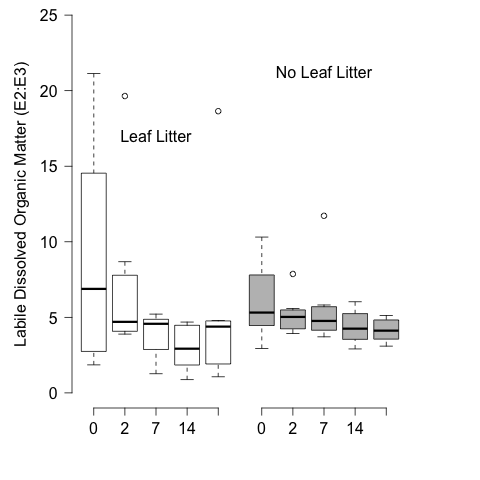
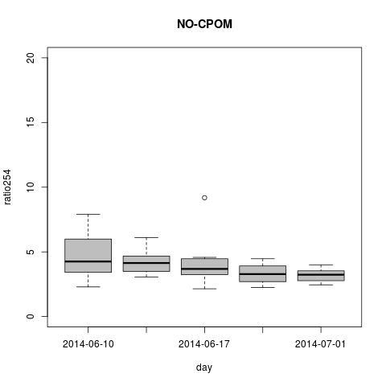
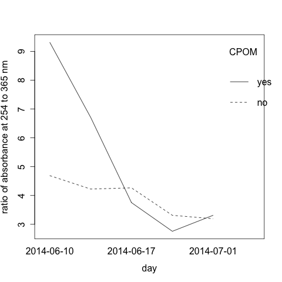

# Analysis of the spec scan results from the CPOM Flux Experiment - Summer 2014

## Purpose

This code it to analyze the spec scan data from the treatments with and without CPOM and/or nutrients

## Load Data

    r254 <- read.table("./data/CPOM_Flux_r254.csv", header = T, sep = ",")

#### Graphical Analysis

    par(mfcol = c(1, 4), mar = c(3, 4, 4, 1))
    plot(ratio254 ~ day, data = r254, subset = CPOM == "yes" & nutrient == "yes", ylim = c(0, 20), col = "dark red", axes = F, xlab = " ", ylab = "Proxy for Labile Dissolved Organic Matter (abs254:abs365)")
    axis(1, at = c(1, 2, 3, 4, 5), labels = c("10-Jun", "12-Jun", "17-Jun", "24-Jun", "1-Jul"))
    axis(2,  las = 2)
    text(3, 20, "Leaf + Enriched")
    plot(ratio254 ~ day, data = r254, subset = CPOM == "yes" & nutrient == "no", ylim = c(0, 20), col = "dark red", axes = F, xlab = " ", ylab = " ")
    axis(1, at = c(1, 2, 3, 4, 5), labels = c("10-Jun", "12-Jun", "17-Jun", "24-Jun", "1-Jul"))
#    axis(2,  las = 2)
    text(3, 20, "Leaf + Ambient")
    plot(ratio254 ~ day, data = r254, subset = CPOM == "no" & nutrient == "yes", ylim = c(0, 20), col = "dark red", axes = F, xlab = " ", ylab = " ")
    axis(1, at = c(1, 2, 3, 4, 5), labels = c("10-Jun", "12-Jun", "17-Jun", "24-Jun", "1-Jul"))
  #   axis(2,  las = 2)
    text(3, 20, "No-Leaf + Enriched")
    plot(ratio254 ~ day, data = r254, subset = CPOM == "no" & nutrient == "no", ylim = c(0, 20), col = "dark red", axes = F, xlab = " ", ylab = " ")
    axis(1, at = c(1, 2, 3, 4, 5), labels = c("10-Jun", "12-Jun", "17-Jun", "24-Jun", "1-Jul"))
    #  axis(2,  las = 2)
    text(3, 20, "No-Leaf + Ambient")

    par(mfcol = c(1, 2), mar = c(5, 5, 0, 0 ))
    plot(ratio254 ~ day, data = r254, subset = CPOM == "yes", ylim = c(0, 20), col = "white", axes = F, xlab = " ", ylab = "Labile Dissolved Organic Matter (abs254:abs365)")
    axis(1, at = c(1, 2, 3, 4, 5), labels = c("0", "2", "7", "14", "21"))
    axis(2,  las = 2)
    text(3, 17, "Leaf Litter")
    par(mar = c(5, 0, 0, 5))
    plot(ratio254 ~ day, data = r254, subset = CPOM == "no", ylim = c(0, 20), col = 8, axes = F, xlab = " ", ylab = " ")
    axis(1, at = c(1, 2, 3, 4, 5), labels = c("0", "2", "7", "14", "21") )
    #    axis#(2,  las = 2)
    text(3, 17, "No Leaf Litter")
    text(-2, -2, "Days Incubated")
    

    dev.copy(png, "./output/plots/cpom_flux_ratio254_by_day_CPOM.png")
    dev.off()

_ratio254 by day with CPOM_

    plot(ratio254 ~ day, data = ratio254, subset = CPOM == "no", ylim = c(0, 20), main = "NO-CPOM", col = 8)
    dev.copy(png, "./output/plots/cpom_flux_ratio254_by_day_noCPOM.png")
    dev.off()

_ratio254 by day with no CPOM_
    
    interaction.plot(ratio254$day, ratio254$CPOM, ratio254$ratio254, fun = "mean", xlab = "day", ylab = "ratio of absorbance at 254 to 365 nm", trace.label = "CPOM")
    dev.copy(png, "./output/plots/cpom_flux_ratio254_by_day_interaction.png")
    dev.off()

_ratio254 interaction between CPOM and day_

### Calculate S275-295

    spec.s275 <- spec[spec$wl >= 275 & spec$wl <= 295, ]

    max.s275 <- as.numeric(tapply(spec.s275$abs, list(spec.s275$bod, spec.s275$day), max))
    min.s275 <- as.numeric(tapply(spec.s275$abs, list(spec.s275$bod, spec.s275$day), min))
    rise <- max.s275 - min.s275
    run <- 295 - 275
    s275 <- rise / run

