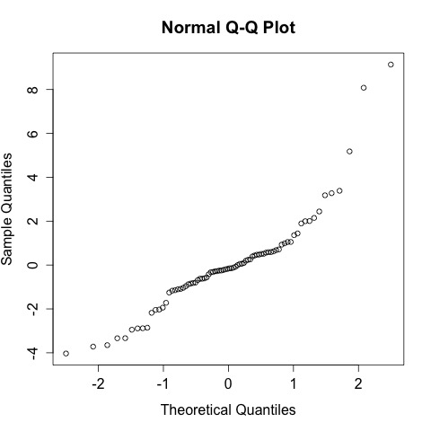

# Analysis of the spec scan results from the CPOM Flux Experiment - Summer 2014

## Purpose

This code it to analyze the spec scan data from the treatments with and without CPOM and/or nutrients

## Load Data

    r254 <- read.table("./data/CPOM_Flux_r254.csv", header = T, sep = ",")

## Statistical Summary

Summary of the 254:365 absorbance in all of the samples on all days

    summary(r254$ratio254)

~~~~

   Min. 1st Qu.  Median    Mean 3rd Qu.    Max. 
 0.6973  3.1200  4.1140  4.5540  4.8010 20.1000 

~~~~

### Repeated Measures Analysis
  
Requires the `lmerTest` package

    library("lmerTest", lib.loc="~/Library/R/3.1/library")

#### Specify the formula

    r254.mod <- lmer(ratio254 ~ 1 + elapsed.d * CPOM * nutrient + (1 + elapsed.d|bod), r254)
    summary(r254.mod)

~~~~
  
Linear mixed model fit by REML t-tests use Satterthwaite approximations to degrees of
  freedom [merModLmerTest]
Formula: ratio254 ~ 1 + elapsed.d * CPOM * nutrient + (1 + elapsed.d |      bod)
   Data: r254

REML criterion at convergence: 380

Scaled residuals: 
    Min      1Q  Median      3Q     Max 
-1.6840 -0.4102 -0.0684  0.2502  3.8161 

Random effects:
 Groups   Name        Variance Std.Dev. Corr 
 bod      (Intercept) 3.01018  1.7350        
          elapsed.d   0.01761  0.1327   -1.00
 Residual             5.73333  2.3944        
Number of obs: 80, groups:  bod, 16

Fixed effects:
                              Estimate Std. Error       df t value Pr(>|t|)   
(Intercept)                    4.12632    1.18566 12.24300   3.480  0.00442 **
elapsed.d                     -0.02406    0.09559 13.40200  -0.252  0.80506   
CPOMyes                        3.31179    1.67677 12.24300   1.975  0.07124 . 
nutrientyes                    0.86930    1.67677 12.24300   0.518  0.61339   
elapsed.d:CPOMyes             -0.23125    0.13518 13.40200  -1.711  0.11019   
elapsed.d:nutrientyes         -0.09375    0.13518 13.40200  -0.694  0.49983   
CPOMyes:nutrientyes           -0.77538    2.37131 12.24300  -0.327  0.74920   
elapsed.d:CPOMyes:nutrientyes  0.07845    0.19118 13.40200   0.410  0.68802   
---

Correlation of Fixed Effects:
            (Intr) elpsd. CPOMys ntrnty el.:CPOM elps.: CPOMy:
elapsed.d   -0.875                                            
CPOMyes     -0.707  0.619                                     
nutrientyes -0.707  0.619  0.500                              
elpsd.:CPOM  0.619 -0.707 -0.875 -0.438                       
elpsd.d:ntr  0.619 -0.707 -0.438 -0.875  0.500                
CPOMys:ntrn  0.500 -0.438 -0.707 -0.707  0.619    0.619       
elps.:CPOM: -0.438  0.500  0.619  0.619 -0.707   -0.707 -0.875

~~~~
  
#### Check Assumptions
  
Checking for homogeniety of variance with a plot of the residuals by the fitted

    plot(r254.mod)
    dev.copy(jpeg, "./output/plots/r254_resid_fitted.jpg")
    dev.off()

Overall the assumption seems to be reasonably met.

Checking for normality of the residuals with a qqnorm plot 

    qqnorm(resid(r254.mod))
    dev.copy(jpeg, "./output/plots/r254_qqnorm_resid.jpg")
    dev.off()

This plot shows some departure from normality but I will take it.

#### Test for significance of Fixed Effects
  
    anova(r254.mod)

~~~~
  
Analysis of Variance Table of type III  with  Satterthwaite 
approximation for degrees of freedom
                        Sum Sq Mean Sq NumDF  DenDF F.value   Pr(>F)   
elapsed.d               69.955  69.955     1 13.402 12.2015 0.003803 **
CPOM                    34.872  34.872     1 12.243  6.0823 0.029344 * 
nutrient                 0.946   0.946     1 12.243  0.1650 0.691607   
elapsed.d:CPOM          23.136  23.136     1 13.402  4.0353 0.065144 . 
elapsed.d:nutrient       1.865   1.865     1 13.402  0.3254 0.577844   
CPOM:nutrient            0.613   0.613     1 12.243  0.1069 0.749203   
elapsed.d:CPOM:nutrient  0.966   0.966     1 13.402  0.1684 0.688017   

~~~~

#### Graphical Analysis

##### Plot of means and scatterplot

    ratio254.CPOM.mean <- as.numeric(tapply(r254$ratio254[r254$CPOM == "yes"], r254$elapsed.d[r254$CPOM == "yes"], mean))  
    ratio254.noCPOM.mean <- as.numeric(tapply(r254$ratio254[r254$CPOM == "no"], r254$elapsed.d[r254$CPOM == "no"], mean)) 

     par(las = 1) 
     plot(ratio254 ~ jitter(elapsed.d, 1), data = r254, subset = CPOM == "yes", pch = 1, xlim = c(0, 25), ylim = c(0, 20), xlab = "Days of Incubation", ylab = "DOM Quality (abs254:abs365)", cex = 1.1)
     points(ratio254 ~ jitter(elapsed.d, 1), data = r254, subset = CPOM == "no", pch = 2, cex = 1.1)
     points(ratio254.CPOM.mean ~ unique(r254$elapsed.d), type = "b", pch = 16, cex = 1.6)
     points(ratio254.noCPOM.mean ~ unique(r254$elapsed.d), type = "b", pch = 17, cex = 1.6)
     legend(15, 20, c("Leaf Litter", "No Leaf Litter"), pch = c(16, 17))

##### Boxplots  
  
    par(mfcol = c(1, 4), mar = c(3, 4, 4, 1))
    plot(ratio254 ~ day, data = r254, subset = CPOM == "yes" & nutrient == "yes", ylim = c(0, 20), col = "dark red", axes = F, xlab = " ", ylab = "Proxy for Labile Dissolved Organic Matter (abs254:abs365)")
    axis(1, at = c(1, 2, 3, 4, 5), labels = c("10-Jun", "12-Jun", "17-Jun", "24-Jun", "1-Jul"))
    axis(2,  las = 2)
    text(3, 20, "Leaf + Enriched")
    plot(ratio254 ~ day, data = r254, subset = CPOM == "yes" & nutrient == "no", ylim = c(0, 20), col = "dark red", axes = F, xlab = " ", ylab = " ")
    axis(1, at = c(1, 2, 3, 4, 5), labels = c("10-Jun", "12-Jun", "17-Jun", "24-Jun", "1-Jul"))
#    axis(2,  las = 2)
    text(3, 20, "Leaf + Ambient")
    plot(ratio254 ~ day, data = r254, subset = CPOM == "no" & nutrient == "yes", ylim = c(0, 20), col = "dark red", axes = F, xlab = " ", ylab = " ")
    axis(1, at = c(1, 2, 3, 4, 5), labels = c("10-Jun", "12-Jun", "17-Jun", "24-Jun", "1-Jul"))
  #   axis(2,  las = 2)
    text(3, 20, "No-Leaf + Enriched")
    plot(ratio254 ~ day, data = r254, subset = CPOM == "no" & nutrient == "no", ylim = c(0, 20), col = "dark red", axes = F, xlab = " ", ylab = " ")
    axis(1, at = c(1, 2, 3, 4, 5), labels = c("10-Jun", "12-Jun", "17-Jun", "24-Jun", "1-Jul"))
    #  axis(2,  las = 2)
    text(3, 20, "No-Leaf + Ambient")

    par(mfcol = c(1, 2), mar = c(5, 5, 0, 0 ))
    plot(ratio254 ~ day, data = r254, subset = CPOM == "yes", ylim = c(0, 20), col = "white", axes = F, xlab = " ", ylab = "Labile Dissolved Organic Matter (abs254:abs365)")
    axis(1, at = c(1, 2, 3, 4, 5), labels = c("0", "2", "7", "14", "21"))
    axis(2,  las = 2)
    text(3, 17, "Leaf Litter")
    par(mar = c(5, 0, 0, 5))
    plot(ratio254 ~ day, data = r254, subset = CPOM == "no", ylim = c(0, 20), col = 8, axes = F, xlab = " ", ylab = " ")
    axis(1, at = c(1, 2, 3, 4, 5), labels = c("0", "2", "7", "14", "21") )
    #    axis#(2,  las = 2)
    text(3, 17, "No Leaf Litter")
    text(-2, -2, "Days Incubated")
    

    dev.copy(png, "./output/plots/cpom_flux_ratio254_by_day_CPOM.png")
    dev.off()

_ratio254 by day with CPOM_

    plot(ratio254 ~ day, data = r254, subset = CPOM == "no", ylim = c(0, 20), main = "NO-CPOM", col = 8)
    dev.copy(png, "./output/plots/cpom_flux_ratio254_by_day_noCPOM.png")
    dev.off()

_ratio254 by day with no CPOM_
    
    interaction.plot(r254$day, r254$CPOM, r254$ratio254, fun = "mean", xlab = "day", ylab = "ratio of absorbance at 254 to 365 nm", trace.label = "CPOM")
    dev.copy(png, "./output/plots/cpom_flux_ratio254_by_day_interaction.png")
    dev.off()

_ratio254 interaction between CPOM and day_

