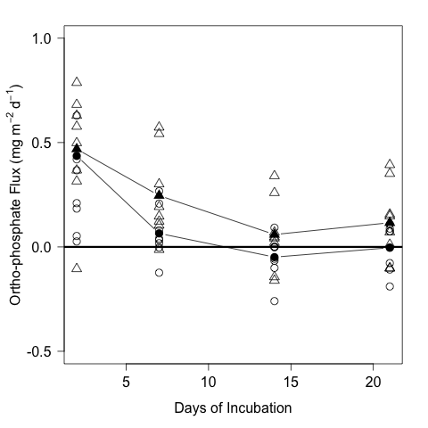

# Analysis of the Areal Nutrient Flux from the CPOM Flux Exp.

## Summer 2014

## Metadata

* Code created 3 March 2015 - KF

* Modified 10 March 2015 - KF - continued analysis
* Modified 24 March 2015 - KF - made figures consistent with SOD for ASB Talk
* Modified 8 May 2015 - KF - analyzed data with repeated measures using lme and lmeTest package

## Purpose

This code is to analyze the effect of the nutrient and CPOM addition treatments on the flux of NOx, NH4, and PO4 across the sediment water interface in the CPOM Flux experiment.

## Code
### Import Data

Flux calculations can be found in `CPOM_Flux_Nutrient_Flux_Calc.md` in the `analysis` directory.

    nut <- read.table("./data/CPOM_Flux_Nutrient_Flux_calc.csv", header = T, sep = ",")

### Summary Statistics

#### NOx
##### Total
    summary(nut$NOx)

~~~~

  Min.  1st Qu.   Median     Mean  3rd Qu.     Max. 
-40.9500  -9.2510  -0.7163  11.2300   2.6620 181.1000 

~~~~

##### Ambient Nutrient Treatment

    summary(nut$NOx[nut$NUT == "0"])

~~~~

  Min.  1st Qu.   Median     Mean  3rd Qu.     Max. 
-32.2900  -8.6660  -0.6576  12.5900   2.6620 179.9000 

~~~~

##### Enriched Nutrient Treatment

    summary(nut$NOx[nut$NUT == "N"])

~~~~

   Min.  1st Qu.   Median     Mean  3rd Qu.     Max. 
-40.9500 -10.2700  -0.7163   9.8610   5.5520 181.1000 

~~~~

##### Ambient CPOM 

    summary(nut$NOx[nut$CPOM == "0"])

~~~~~

  Min. 1st Qu.  Median    Mean 3rd Qu.    Max. 
-40.950 -10.230  -1.571  23.100  12.090 181.100 

~~~~~

##### Added CPOM

     summary(nut$NOx[nut$CPOM == "C"])

~~~~

   Min.  1st Qu.   Median     Mean  3rd Qu.     Max. 
-20.4000  -8.7810  -0.5527  -0.6438   1.1080  37.1600 

~~~~

#### NH3
##### Total
    summary(nut$NH3)

~~~~

  Min. 1st Qu.  Median    Mean 3rd Qu.    Max. 
-4.5650 -1.1510 -0.7626 -0.6896 -0.1123  7.4250 
~~~~

##### Ambient Nutrient Treatment

    summary(nut$NH3[nut$NUT == "0"])

~~~~

  Min.  1st Qu.   Median     Mean  3rd Qu.     Max. 
-2.42500 -0.99630 -0.60300 -0.34380  0.01741  4.40800 

~~~~

##### Enriched Nutrient Treatment

    summary(nut$NH3[nut$NUT == "N"])

~~~~

  Min. 1st Qu.  Median    Mean 3rd Qu.    Max. 
-4.5650 -1.3320 -0.8687 -1.0350 -0.2867  7.4250 
~~~~

##### Ambient CPOM 

    summary(nut$NH3[nut$CPOM == "0"])

~~~~~

 Min. 1st Qu.  Median    Mean 3rd Qu.    Max. 
-4.5650 -1.5880 -0.9615 -0.9681 -0.2636  4.4080 

~~~~~

##### Added CPOM

     summary(nut$NH3[nut$CPOM == "C"])

~~~~

   Min.  1st Qu.   Median     Mean  3rd Qu.     Max. 
-3.54900 -0.95060 -0.74780 -0.41120  0.04588  7.42500 

~~~~

#### P
##### Total
    summary(nut$P)

~~~~

     Min.   1st Qu.    Median      Mean   3rd Qu.      Max. 
-0.259700 -0.001705  0.077280  0.167300  0.304400  1.600000 

~~~~

##### Ambient Nutrient Treatment

    summary(nut$P[nut$NUT == "0"])

~~~~

 Min.  1st Qu.   Median     Mean  3rd Qu.     Max. 
-0.18940  0.03151  0.09001  0.15530  0.28540  0.68210 

~~~~

##### Enriched Nutrient Treatment

    summary(nut$P[nut$NUT == "N"])

~~~~

  Min.   1st Qu.    Median      Mean   3rd Qu.      Max. 
-0.259700 -0.005352  0.063720  0.179400  0.304400  1.600000 

~~~~

##### Ambient CPOM 

    summary(nut$P[nut$CPOM == "0"])

~~~~~

  Min.  1st Qu.   Median     Mean  3rd Qu.     Max. 
-0.16070  0.03645  0.15190  0.22260  0.37380  0.78710 

~~~~~

##### Added CPOM

     summary(nut$P[nut$CPOM == "C"])

~~~~

   Min.  1st Qu.   Median     Mean  3rd Qu.     Max. 
-0.25970 -0.01620  0.03673  0.11210  0.12760  1.60000 

~~~~

### Plots
#### NOx

    par(las = 1, mar = c(5, 5, 2, 2))
    plot(NOx ~ days, data = nut, subset = CPOM == "C", ylim = c(-50, 200), pch = 1, ylab = expression(paste("Nitrate Flux (mg m"^{-2}, " d"^{-1}, ")")), xlab = "Days of Incubation", cex.axis = 1.5, cex.lab = 1.5, cex = 2)
    points(NOx ~ days, data = nut, subset = CPOM == "0", pch = 2, col = 1, cex = 2)
    abline(h = 0, lwd = 3)
    means.NOx.CPOM <- c(mean(nut$NOx[nut$CPOM == "C" & nut$days == 2]), mean(nut$NOx[nut$CPOM == "C" & nut$days == 7]), mean(nut$NOx[nut$CPOM == "C" & nut$days == 14]), mean(nut$NOx[nut$CPOM == "C" & nut$days == 21])) 
    means.NOx.NCPOM <- c(mean(nut$NOx[nut$CPOM == "0" & nut$days == 2]), mean(nut$NOx[nut$CPOM == "0" & nut$days == 7]), mean(nut$NOx[nut$CPOM == "0" & nut$days == 14]), mean(nut$NOx[nut$CPOM == "0" & nut$days == 21])) 
    points(unique(nut$days), means.NOx.CPOM, type = "b", pch = 16, cex = 2.5)   
    points(unique(nut$days), means.NOx.NCPOM, type = "b", pch = 17, col = 1, cex = 2.5)
    legend(10, 200, c("Leaf Litter ", "No Leaf Litter "), pch = c(16, 17), col = c(1, 1), cex = 1.5)
    dev.copy(png, "./output/plots/CPOM_Flux_NOx_flux.png")
    dev.off()

#### NH3

    par(las = 1, mar = c(5, 5, 2, 2))
    plot(NH3 ~ days, data = nut, subset = CPOM == "C", ylim = c(-5, 10), pch = 1, ylab = expression(paste("Ammonium Flux (mg m"^{-2}, " d"^{-1}, ")")), xlab = "Days of Incubation", cex.lab = 1.5, cex.axis = 1.5, cex = 2)
    points(NH3 ~ days, data = nut, subset = CPOM == "0", pch = 2, col = 1, cex = 2)
    abline(h = 0, lwd = 3)
    means.NH3.CPOM <- c(mean(nut$NH3[nut$CPOM == "C" & nut$days == 2]), mean(nut$NH3[nut$CPOM == "C" & nut$days == 7]), mean(nut$NH3[nut$CPOM == "C" & nut$days == 14]), mean(nut$NH3[nut$CPOM == "C" & nut$days == 21])) 
    means.NH3.NCPOM <- c(mean(nut$NH3[nut$CPOM == "0" & nut$days == 2]), mean(nut$NH3[nut$CPOM == "0" & nut$days == 7]), mean(nut$NH3[nut$CPOM == "0" & nut$days == 14]), mean(nut$NH3[nut$CPOM == "0" & nut$days == 21])) 
    points(unique(nut$days), means.NH3.CPOM, type = "b", pch = 16, cex = 2.5)   
    points(unique(nut$days), means.NH3.NCPOM, type = "b", pch = 17, cex = 2.5, col = 1)
    legend(10, 10, c("Leaf Litter ", "No Leaf Litter "), pch = c(16, 17), col = c(1, 1), cex = 1.5)
    dev.copy(png, "./output/plots/CPOM_Flux_NH3_flux.png")
    dev.off()

#### P

    par(las = 1, mar = c(5, 5, 2, 2))
    plot(P ~ days, data = nut, subset = CPOM == "C", ylim = c(-0.5, 1), pch = 1, ylab = expression(paste("Ortho-phosphate Flux (mg m"^{-2}, " d"^{-1}, ")")), xlab = "Days of Incubation", cex.lab = 1.5, cex.axis = 1.5, cex = 2)
    points(P ~ days, data = nut, subset = CPOM == "0", pch = 2, col = 1, cex = 2)
    abline(h = 0, lwd = 3)
    means.P.CPOM <- c(mean(nut$P[nut$CPOM == "C" & nut$days == 2]), mean(nut$P[nut$CPOM == "C" & nut$days == 7]), mean(nut$P[nut$CPOM == "C" & nut$days == 14]), mean(nut$P[nut$CPOM == "C" & nut$days == 21])) 
means.P.NCPOM <- c(mean(nut$P[nut$CPOM == "0" & nut$days == 2]), mean(nut$P[nut$CPOM == "0" & nut$days == 7]), mean(nut$P[nut$CPOM == "0" & nut$days == 14]), mean(nut$P[nut$CPOM == "0" & nut$days == 21])) 
    points(unique(nut$days), means.P.CPOM, type = "b", pch = 16, cex = 2.5)   
    points(unique(nut$days), means.P.NCPOM, type = "b", pch = 17, cex = 2.5)   
    legend(10, 1, c("Leaf Litter ", "No Leaf Litter "), pch = c(16, 17), col = c(1, 1), cex = 1.5)
    dev.copy(png, "./output/plots/CPOM_Flux_P_flux.png")
    dev.off()

### Repeated Measures Analysis

To complete the repeated measures I need to add a variable for the identity of the BOD bottles

    BOD <- 1:16

    nut <- data.frame(BOD, nut)
    
Based on the research for the correct method for `CPOM_Flux_SOD_Analysis.md` I analyzed these data with the `lmer` function from the `lmerTest` package ([http://cran.r-project.org/web/packages/lmerTest//lmerTest.pdf](http://cran.r-project.org/web/packages/lmerTest//lmerTest.pdf))

#### Nitrate and Nitrite

Model:
  
    fm.NOx <- lmer(NOx ~ 1 + days * CPOM * NUT + (1 + days | BOD), data = nut)
    summary(fm.NOx)

~~~~

> summary(fm.NOx)
Linear mixed model fit by REML t-tests use Satterthwaite approximations to degrees of freedom [
merModLmerTest]
Formula: NOx ~ 1 + days * CPOM * NUT + (1 + days | BOD)
   Data: nut

REML criterion at convergence: 607.2

Scaled residuals: 
     Min       1Q   Median       3Q      Max 
-2.28131 -0.29071 -0.04767  0.35740  2.79794 

Random effects:
 Groups   Name        Variance Std.Dev. Corr 
 BOD      (Intercept)  437.714 20.92         
          days           1.539  1.24    -1.00
 Residual             1422.135 37.71         
Number of obs: 64, groups:  BOD, 16

Fixed effects:
                Estimate Std. Error       df t value Pr(>|t|)    
(Intercept)      92.7687    20.1778  12.1480   4.598 0.000594 ***
days             -5.9676     1.4528  19.9630  -4.108 0.000549 ***
CPOMC           -88.2723    28.5358  12.1480  -3.093 0.009183 ** 
NUTN            -18.0342    28.5358  12.1480  -0.632 0.539108    
days:CPOMC        5.3827     2.0545  19.9630   2.620 0.016419 *  
days:NUTN         0.9073     2.0545  19.9630   0.442 0.663502    
CPOMC:NUTN       24.1854    40.3557  12.1480   0.599 0.559979    
days:CPOMC:NUTN  -1.2313     2.9055  19.9630  -0.424 0.676267    
---

Correlation of Fixed Effects:
            (Intr) days   CPOMC  NUTN   dy:CPOMC d:NUTN CPOMC:
days        -0.869                                            
CPOMC       -0.707  0.614                                     
NUTN        -0.707  0.614  0.500                              
days:CPOMC   0.614 -0.707 -0.869 -0.434                       
days:NUTN    0.614 -0.707 -0.434 -0.869  0.500                
CPOMC:NUTN   0.500 -0.434 -0.707 -0.707  0.614    0.614       
d:CPOMC:NUT -0.434  0.500  0.614  0.614 -0.707   -0.707 -0.869

~~~~

These results show the fit of the model but include the test of the t-test as to whether beta = 0. This is not the same as the test of the significants of the factor on the response.  See more information at [http://stats.stackexchange.com/questions/28938/why-do-linear-regression-and-anova-give-different-p-value-in-case-of-consideri](http://stats.stackexchange.com/questions/28938/why-do-linear-regression-and-anova-give-different-p-value-in-case-of-consideri).

To get the F-tests which show the sig of the factors for the response you need a to run the anova on the model.

    anova(fm.NOx)

~~~~
  
> anova(fm.NOx)
Analysis of Variance Table of type III  with  Satterthwaite 
approximation for degrees of freedom
               Sum Sq Mean Sq NumDF  DenDF F.value    Pr(>F)    
days          26412.9 26412.9     1 19.964 18.5727 0.0003424 ***
CPOM          20270.8 20270.8     1 12.149 14.2538 0.0025910 ** 
NUT             123.3   123.3     1 12.149  0.0867 0.7733805    
days:CPOM     15312.7 15312.7     1 19.964 10.7674 0.0037392 ** 
days:NUT         57.3    57.3     1 19.964  0.0403 0.8428898    
CPOM:NUT        510.8   510.8     1 12.149  0.3592 0.5599788    
days:CPOM:NUT   255.4   255.4     1 19.964  0.1796 0.6762666    

~~~~

The results indicate that the nitrate and nitrite flux varys with CPOM and days and that there is a significant interaction between CPOM and day. However consideration of the plot of the residuals by fitted (`plot(fm.NOx)`) shows some ugliness where there is correlation with the magnitude of the residuals and the fitted value. This is evident from the plot (above) where it is clear there is not homogeneity of variance across dates. 
#### Ammonium

Model:
  
    fm.NH3 <- lmer(NH3 ~ 1 + days * CPOM * NUT + (1 + days | BOD), data = nut)
    summary(fm.NH3)

~~~~
  
> summary(fm.NH3)
Linear mixed model fit by REML t-tests use Satterthwaite approximations to degrees of freedom [
merModLmerTest]
Formula: NH3 ~ 1 + days * CPOM * NUT + (1 + days | BOD)
   Data: nut

REML criterion at convergence: 246.8

Scaled residuals: 
    Min      1Q  Median      3Q     Max 
-1.8709 -0.4778 -0.0985  0.4086  3.3800 

Random effects:
 Groups   Name        Variance Std.Dev. Corr 
 BOD      (Intercept) 3.12984  1.7691        
          days        0.01072  0.1035   -1.00
 Residual             1.93278  1.3902        
Number of obs: 64, groups:  BOD, 16

Fixed effects:
                Estimate Std. Error       df t value Pr(>|t|)
(Intercept)     -0.93319    1.08953 12.04200  -0.857    0.408
days             0.05849    0.07090 13.77400   0.825    0.423
CPOMC            0.69612    1.54083 12.04200   0.452    0.659
NUTN            -2.61374    1.54083 12.04200  -1.696    0.116
days:CPOMC      -0.07310    0.10026 13.77400  -0.729    0.478
days:NUTN        0.11429    0.10026 13.77400   1.140    0.274
CPOMC:NUTN       2.50866    2.17906 12.04200   1.151    0.272
days:CPOMC:NUTN -0.10715    0.14179 13.77400  -0.756    0.463

Correlation of Fixed Effects:
            (Intr) days   CPOMC  NUTN   dy:CPOMC d:NUTN CPOMC:
days        -0.927                                            
CPOMC       -0.707  0.655                                     
NUTN        -0.707  0.655  0.500                              
days:CPOMC   0.655 -0.707 -0.927 -0.463                       
days:NUTN    0.655 -0.707 -0.463 -0.927  0.500                
CPOMC:NUTN   0.500 -0.463 -0.707 -0.707  0.655    0.655       
d:CPOMC:NUT -0.463  0.500  0.655  0.655 -0.707   -0.707 -0.927

~~~~

F-tests:
  
     anova(fm.NH3)

~~~~

> anova(fm.NH3)
Analysis of Variance Table of type III  with  Satterthwaite 
approximation for degrees of freedom
              Sum Sq Mean Sq NumDF  DenDF F.value  Pr(>F)  
days          4.2058  4.2058     1 13.774  2.1761 0.16266  
CPOM          6.1940  6.1940     1 12.041  3.2047 0.09858 .
NUT           3.0089  3.0089     1 12.041  1.5568 0.23586  
days:CPOM     6.1710  6.1710     1 13.774  3.1928 0.09598 .
days:NUT      1.4174  1.4174     1 13.774  0.7333 0.40646  
CPOM:NUT      2.5617  2.5617     1 12.041  1.3254 0.27197  
days:CPOM:NUT 1.1038  1.1038     1 13.774  0.5711 0.46256 

~~~~

The results indicate that there is no significant effect of CPOM or nutrients on ammonium flux, nor does the flux vary over the course of the experiment.

#### Orthophosphate

Model:
  
    fm.P <- lmer(P ~ 1 + days * CPOM * NUT + (1 + days | BOD), data = nut)
    summary(fm.P)
    
~~~~
  
> summary(fm.P)
Linear mixed model fit by REML t-tests use Satterthwaite approximations to degrees of freedom [
merModLmerTest]
Formula: P ~ 1 + days * CPOM * NUT + (1 + days | BOD)
   Data: nut

REML criterion at convergence: 43.4

Scaled residuals: 
    Min      1Q  Median      3Q     Max 
-2.0547 -0.5611 -0.0690  0.5849  3.7864 

Random effects:
 Groups   Name        Variance  Std.Dev. Corr 
 BOD      (Intercept) 0.0582425 0.24133       
          days        0.0001976 0.01406  -1.00
 Residual             0.0539034 0.23217       
Number of obs: 64, groups:  BOD, 16

Fixed effects:
                 Estimate Std. Error        df t value Pr(>|t|)  
(Intercept)      0.304063   0.160764 12.058000   1.891   0.0828 .
days            -0.008895   0.010715 14.275000  -0.830   0.4202  
CPOMC            0.003222   0.227354 12.058000   0.014   0.9889  
NUTN             0.250129   0.227354 12.058000   1.100   0.2927  
days:CPOMC      -0.009553   0.015154 14.275000  -0.630   0.5384  
days:NUTN       -0.019767   0.015154 14.275000  -1.304   0.2127  
CPOMC:NUTN      -0.173754   0.321528 12.058000  -0.540   0.5988  
days:CPOMC:NUTN  0.014226   0.021431 14.275000   0.664   0.5174  
---

Correlation of Fixed Effects:
            (Intr) days   CPOMC  NUTN   dy:CPOMC d:NUTN CPOMC:
days        -0.910                                            
CPOMC       -0.707  0.644                                     
NUTN        -0.707  0.644  0.500                              
days:CPOMC   0.644 -0.707 -0.910 -0.455                       
days:NUTN    0.644 -0.707 -0.455 -0.910  0.500                
CPOMC:NUTN   0.500 -0.455 -0.707 -0.707  0.644    0.644       
d:CPOMC:NUT -0.455  0.500  0.644  0.644 -0.707   -0.707 -0.910

~~~~
  
F-tests:
  
    anova(fm.P)

~~~~
  
> anova(fm.P)
Analysis of Variance Table of type III  with  Satterthwaite 
approximation for degrees of freedom
               Sum Sq Mean Sq NumDF  DenDF F.value   Pr(>F)   
days          0.75101 0.75101     1 14.275 13.9325 0.002161 **
CPOM          0.01460 0.01460     1 12.058  0.2708 0.612235   
NUT           0.05558 0.05558     1 12.058  1.0312 0.329825   
days:CPOM     0.00280 0.00280     1 14.275  0.0519 0.823078   
days:NUT      0.07517 0.07517     1 14.275  1.3945 0.256946   
CPOM:NUT      0.01574 0.01574     1 12.058  0.2920 0.598763   
days:CPOM:NUT 0.02375 0.02375     1 14.275  0.4407 0.517383  

~~~~