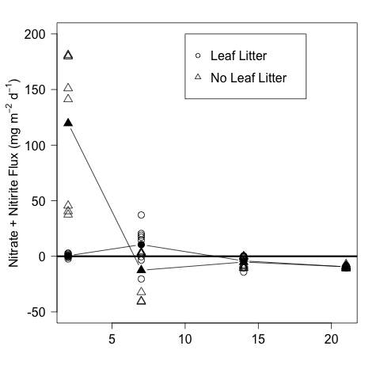
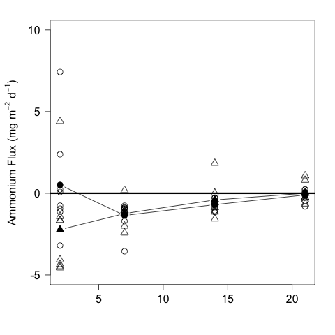

# Analysis of the Areal Nutrient Flux from the CPOM Flux Exp.

## Summer 2014

## Metadata

* Code created 3 March 2015 - KF

* Modified 10 March 2015 - KF - continued analysis

## Purpose

This code is to analyze the effect of the nutrient and CPOM addition treatments on the flux of NOx, NH4, and PO4 across the sediment water interface in the CPOM Flux experiment.

## Code
### Import Data

Flux calculations can be found in `CPOM_Flux_Nutrient_Flux_Calc.md` in the `analysis` directory.

    nut <- read.table("./data/CPOM_Flux_Nutrient_Flux_calc.csv", header = T, sep = ",")

### Summary Statistics

#### NOx
##### Total
    summary(nut$NOx)

~~~~

  Min.  1st Qu.   Median     Mean  3rd Qu.     Max. 
-40.9500  -9.2510  -0.7163  11.2300   2.6620 181.1000 

~~~~

##### Ambient Nutrient Treatment

    summary(nut$NOx[nut$NUT == "0"])

~~~~

  Min.  1st Qu.   Median     Mean  3rd Qu.     Max. 
-32.2900  -8.6660  -0.6576  12.5900   2.6620 179.9000 

~~~~

##### Enriched Nutrient Treatment

    summary(nut$NOx[nut$NUT == "N"])

~~~~

   Min.  1st Qu.   Median     Mean  3rd Qu.     Max. 
-40.9500 -10.2700  -0.7163   9.8610   5.5520 181.1000 

~~~~

##### Ambient CPOM 

    summary(nut$NOx[nut$CPOM == "0"])

~~~~~

  Min. 1st Qu.  Median    Mean 3rd Qu.    Max. 
-40.950 -10.230  -1.571  23.100  12.090 181.100 

~~~~~

##### Added CPOM

     summary(nut$NOx[nut$CPOM == "C"])

~~~~

   Min.  1st Qu.   Median     Mean  3rd Qu.     Max. 
-20.4000  -8.7810  -0.5527  -0.6438   1.1080  37.1600 

~~~~

#### NH3
##### Total
    summary(nut$NH3)

~~~~

  Min. 1st Qu.  Median    Mean 3rd Qu.    Max. 
-4.5650 -1.1510 -0.7626 -0.6896 -0.1123  7.4250 
~~~~

##### Ambient Nutrient Treatment

    summary(nut$NH3[nut$NUT == "0"])

~~~~

  Min.  1st Qu.   Median     Mean  3rd Qu.     Max. 
-2.42500 -0.99630 -0.60300 -0.34380  0.01741  4.40800 

~~~~

##### Enriched Nutrient Treatment

    summary(nut$NH3[nut$NUT == "N"])

~~~~

  Min. 1st Qu.  Median    Mean 3rd Qu.    Max. 
-4.5650 -1.3320 -0.8687 -1.0350 -0.2867  7.4250 
~~~~

##### Ambient CPOM 

    summary(nut$NH3[nut$CPOM == "0"])

~~~~~

 Min. 1st Qu.  Median    Mean 3rd Qu.    Max. 
-4.5650 -1.5880 -0.9615 -0.9681 -0.2636  4.4080 

~~~~~

##### Added CPOM

     summary(nut$NH3[nut$CPOM == "C"])

~~~~

   Min.  1st Qu.   Median     Mean  3rd Qu.     Max. 
-3.54900 -0.95060 -0.74780 -0.41120  0.04588  7.42500 

~~~~

#### P
##### Total
    summary(nut$P)

~~~~

     Min.   1st Qu.    Median      Mean   3rd Qu.      Max. 
-0.259700 -0.001705  0.077280  0.167300  0.304400  1.600000 

~~~~

##### Ambient Nutrient Treatment

    summary(nut$P[nut$NUT == "0"])

~~~~

 Min.  1st Qu.   Median     Mean  3rd Qu.     Max. 
-0.18940  0.03151  0.09001  0.15530  0.28540  0.68210 

~~~~

##### Enriched Nutrient Treatment

    summary(nut$P[nut$NUT == "N"])

~~~~

  Min.   1st Qu.    Median      Mean   3rd Qu.      Max. 
-0.259700 -0.005352  0.063720  0.179400  0.304400  1.600000 

~~~~

##### Ambient CPOM 

    summary(nut$P[nut$CPOM == "0"])

~~~~~

  Min.  1st Qu.   Median     Mean  3rd Qu.     Max. 
-0.16070  0.03645  0.15190  0.22260  0.37380  0.78710 

~~~~~

##### Added CPOM

     summary(nut$P[nut$CPOM == "C"])

~~~~

   Min.  1st Qu.   Median     Mean  3rd Qu.     Max. 
-0.25970 -0.01620  0.03673  0.11210  0.12760  1.60000 

~~~~

### Plots
#### NOx

    par(las = 1, cex = 1.5, mar = c(4, 5, 2, 2))
    plot(NOx ~ days, data = nut, subset = CPOM == "C", ylim = c(-50, 200), pch = 16, ylab = expression(paste("Nitrate Flux (mg m"^{-2}, " d"^{-1}, ")")), xlab = "Days of Incubation")
    points(NOx ~ days, data = nut, subset = CPOM == "0", pch = 16, col = 4)
    abline(h = 0)
    means.NOx.CPOM <- c(mean(nut$NOx[nut$CPOM == "C" & nut$days == 2]), mean(nut$NOx[nut$CPOM == "C" & nut$days == 7]), mean(nut$NOx[nut$CPOM == "C" & nut$days == 14]), mean(nut$NOx[nut$CPOM == "C" & nut$days == 21])) 
    means.NOx.NCPOM <- c(mean(nut$NOx[nut$CPOM == "0" & nut$days == 2]), mean(nut$NOx[nut$CPOM == "0" & nut$days == 7]), mean(nut$NOx[nut$CPOM == "0" & nut$days == 14]), mean(nut$NOx[nut$CPOM == "0" & nut$days == 21])) 
    points(unique(nut$days), means.NOx.CPOM, type = "l")   
    points(unique(nut$days), means.NOx.NCPOM, type = "l", col = 4)
    legend(10, 200, c("CPOM", "No CPOM"), pch = c(16, 16), col = c(1, 4))
    dev.copy(png, "./output/plots/CPOM_Flux_NOx_flux.png")
    dev.off()

#### NH3

    par(las = 1, cex = 1.5, mar = c(4, 5, 2, 2))
    plot(NH3 ~ days, data = nut, subset = CPOM == "C", ylim = c(-10, 10), pch = 16, ylab = expression(paste("Ammonium Flux (mg m"^{-2}, " d"^{-1}, ")")), xlab = "Days of Incubation")
    points(NH3 ~ days, data = nut, subset = CPOM == "0", pch = 16, col = 4)
    abline(h = 0)
    means.NH3.CPOM <- c(mean(nut$NH3[nut$CPOM == "C" & nut$days == 2]), mean(nut$NH3[nut$CPOM == "C" & nut$days == 7]), mean(nut$NH3[nut$CPOM == "C" & nut$days == 14]), mean(nut$NH3[nut$CPOM == "C" & nut$days == 21])) 
    means.NH3.NCPOM <- c(mean(nut$NH3[nut$CPOM == "0" & nut$days == 2]), mean(nut$NH3[nut$CPOM == "0" & nut$days == 7]), mean(nut$NH3[nut$CPOM == "0" & nut$days == 14]), mean(nut$NH3[nut$CPOM == "0" & nut$days == 21])) 
    points(unique(nut$days), means.NH3.CPOM, type = "l")   
    points(unique(nut$days), means.NH3.NCPOM, type = "l", col = 4)
    legend(10, 10, c("CPOM", "No CPOM"), pch = c(16, 16), col = c(1, 4))
    dev.copy(png, "./output/plots/CPOM_Flux_NH3_flux.png")
    dev.off()

#### P

    par(las = 1, cex = 1.5, mar = c(4, 5, 2, 2))
    plot(P ~ days, data = nut, subset = CPOM == "C", ylim = c(-1, 1), pch = 16, ylab = expression(paste("Ammonium Flux (mg m"^{-2}, " d"^{-1}, ")")), xlab = "Days of Incubation")
    points(P ~ days, data = nut, subset = CPOM == "0", pch = 16, col = 4)
    abline(h = 0)
    means.P.CPOM <- c(mean(nut$P[nut$CPOM == "C" & nut$days == 2]), mean(nut$P[nut$CPOM == "C" & nut$days == 7]), mean(nut$P[nut$CPOM == "C" & nut$days == 14]), mean(nut$P[nut$CPOM == "C" & nut$days == 21])) 
    means.P.NCPOM <- c(mean(nut$P[nut$CPOM == "0" & nut$days == 2]), mean(nut$P[nut$CPOM == "0" & nut$days == 7]), mean(nut$P[nut$CPOM == "0" & nut$days == 14]), mean(nut$P[nut$CPOM == "0" & nut$days == 21])) 
    points(unique(nut$days), means.P.CPOM, type = "l")   
    points(unique(nut$days), means.P.NCPOM, type = "l", col = 4)   
    legend(10, 1, c("CPOM", "No CPOM"), pch = c(16, 16), col = c(1, 4))
    dev.copy(png, "./output/plots/CPOM_Flux_P_flux.png")
    dev.off()

### Repeated Measures Analysis

To complete the repeated measures I need to add a variable for the identity of the BOD bottles

    BOD <- 1:16

    nut <- data.frame(BOD, nut)

    summary(aov(NOx ~ CPOM * NUT * days + Error(as.factor(BOD)), data = nut))
    summary(aov(NH3 ~ CPOM * NUT * days + Error(as.factor(BOD)), data = nut))    
    summary(aov(P ~ CPOM * NUT * days + Error(as.factor(BOD)), data = nut))
