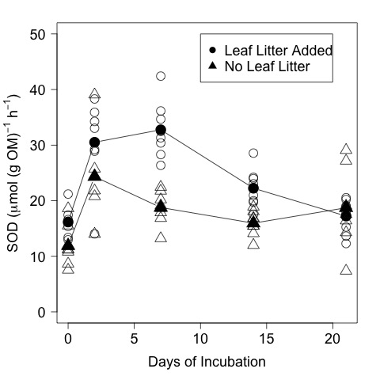

# Analysis of the  from the CPOM Flux Exp.

## Summer 2014

## Metadata

* Code created 23 March 2015 - KF
* Modified 31 March 2015 - KF - corrected SOD units to per h instead of per d
* Modified 7 May 2015 - KF - changed model designation of the repeated measures analysis

## Purpose

This code is to analyze the effect of the nutrient and CPOM addition treatments on SOD in the CPOM Flux experiment.

## Code
### Import Data

Flux calculations can be found in `CPOM_Flux_Exp_SOD_flux_calc.md` in the `analysis` directory

    sod <- read.table("./data/CPOM_Flux_SOD.csv", header = T, sep = ",")

### Repeated Measures Analysis
#### Each Factor Separately

I am using this website to ascertain how to specify the models in R

[http://ww2.coastal.edu/kingw/statistics/R-tutorials/repeated.html](http://ww2.coastal.edu/kingw/statistics/R-tutorials/repeated.html)

    CPOM.aov <- (aov(sod.OM ~ days.elap * CPOM + Error(as.factor(bod)/CPOM), data = sod))
    summary(CPOM.aov)

This model is not correct. R is giving the error that the model is singular

### Plots

    # Plot that shows the CPOM and Nut treatment effects 
    plot(sod.OM ~ days.elap, data = sod, subset = CPOM == "yes" & nutrient == "yes", ylim = c(0, 50), pch = 16, xlab = "Days of Incubation", ylab = expression(paste("SOD (", mu, "mol (g OM)"^{-1}, " h"^{-1}, ")")))
    points(sod.OM ~ days.elap, data = sod, subset = CPOM == "yes" & nutrient == "no", pch = 1)
    points(sod.OM ~ days.elap, data = sod, subset = CPOM == "no" & nutrient == "yes", pch = 16, col = 4)
    points(sod.OM ~ days.elap, data = sod, subset = CPOM == "no" & nutrient == "no", pch = 1, col = 4)

    # Calculation of mean SOD by day and CPOM treatment for plot
    sod.mean.CPOM <- c(mean(sod$sod.OM[sod$days.elap == 0 & sod$CPOM == "yes"]), mean(sod$sod.OM[sod$days.elap == 2 & sod$CPOM == "yes"]), mean(sod$sod.OM[sod$days.elap == 7 & sod$CPOM == "yes"]), mean(sod$sod.OM[sod$days.elap == 14 & sod$CPOM == "yes"]), mean(sod$sod.OM[sod$days.elap == 21 & sod$CPOM == "yes"])) 
    sod.mean.ctl <- c(mean(sod$sod.OM[sod$days.elap == 0 & sod$CPOM == "no"]), mean(sod$sod.OM[sod$days.elap == 2 & sod$CPOM == "no"], na.rm = T), mean(sod$sod.OM[sod$days.elap == 7 & sod$CPOM == "no"]), mean(sod$sod.OM[sod$days.elap == 14 & sod$CPOM == "no"]), mean(sod$sod.OM[sod$days.elap == 21 & sod$CPOM == "no"])) 

    # Plot of OM normalized SOD by days of incubation (for ASB talk)
    par(las = 1, mar = c(5, 5, 2, 2))
    plot(sod.OM ~ days.elap, data = sod, subset = CPOM == "yes", ylim = c(0, 50), xlab = "Days of Incubation", ylab = expression(paste("SOD (", mu, "mol (g OM)"^{-1}, " h"^{-1}, ")")), pch = 1, col = "grey4", cex.axis = 1.5, cex.lab = 1.5, cex = 2)
    points(sod.mean.CPOM ~ unique(days.elap), data = sod, type = "b", pch = 16, col = "black", cex = 2.5)
    points(sod.OM ~ days.elap, data = sod, subset = CPOM == "no", pch = 2, col = "grey4", cex = 2)
    points(sod.mean.ctl ~ unique(days.elap), data = sod, type = "b", pch = 17, col = "black", cex = 2.5)
    legend(10, 50, c("Leaf Litter Added ", "No Leaf Litter "), pch = c(16, 17), cex = 1.5)
    dev.copy(jpeg, "./output/plots/SOD_OM_by_days.jpg")
    dev.off()

