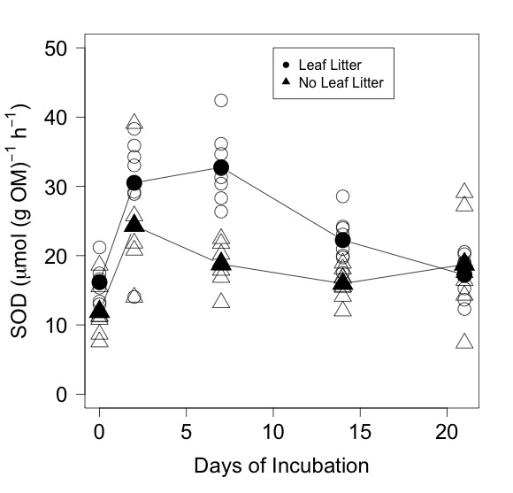

# Analysis of the  from the CPOM Flux Exp.

## Summer 2014

## Metadata

* Code created 23 March 2015 - KF
* Modified 31 March 2015 - KF - corrected SOD units to per h instead of per d
* Modified 7 May 2015 - KF - changed model designation of the repeated measures analysis
* Modified 8 May 2015 - KF - alterd the repeated measures analysis
* Modified 9 June 2015 - KF - reran all analyses based on the updated calculations of SOD with the more comprehensive bottle OM data.

## Purpose

This code is to analyze the effect of the nutrient and CPOM addition treatments on SOD in the CPOM Flux experiment.

## Code
### Import Data

Flux calculations can be found in `CPOM_Flux_Exp_SOD_flux_calc.md` in the `analysis` directory

    sod <- read.table("./data/CPOM_Flux_SOD.csv", header = T, sep = ",")
    # convert bod from `int` to `Factor`
    sod$bod <- as.factor(sod$bod)

### Summary Statistics
#### Areal Flux

    summary(sod$SOD)

~~~~

in mmol O2 / m2 / h  

Min. 1st Qu.  Median    Mean 3rd Qu.    Max.    NAs 
 0.3567  0.7525  0.9226  1.0200  1.2210  2.0980       1 

~~~~

    stem(sod$SOD)

~~~~
in mmol O2 / m2 / h

The decimal point is 1 digit(s) to the left of the |

   2 | 67
   4 | 224478
   6 | 144678899555569
   8 | 01122256677900112244889
  10 | 012455594899
  12 | 0401
  14 | 01134015
  16 | 139289
  18 | 99
  20 | 0

~~~~

#### OM Normalized Flux

    summary(sod$sod.OM)

~~~~
in umol O2 / g OM / h

 Min. 1st Qu.  Median    Mean 3rd Qu.    Max.    NAs 
  7.335  15.400  18.970  20.800  25.000  42.540       1 

~~~~
  
    stem(sod$sod.OM)

~~~~
in umol O2 / g OM / h

The decimal point is 1 digit(s) to the right of the |

  0 | 789
  1 | 11122233344444
  1 | 55555666777777888899999999
  2 | 0000111122234444
  2 | 66789999
  3 | 011334
  3 | 56689
  4 | 3

~~~~

#### Oxygen Concentration

     summary(sod$DO.T0 * 1000)

~~~~

in umol / L

 Min. 1st Qu.  Median    Mean 3rd Qu.    Max.    NAs 
  80.09  202.10  224.80  206.10  235.70  275.80    1.00

~~~~

    stem(sod$DO.T0 * 1000)

~~~~

in umol / L

The decimal point is 1 digit(s) to the right of the |

   8 | 029115
  10 | 00
  12 | 45
  14 | 013456
  16 | 
  18 | 99
  20 | 023777903446899
  22 | 0234445778999911234444455666667799
  24 | 122355779
  26 | 026

~~~~

The subset of low DO values all come from the T-0 incubation day

    par(las = 1, cex = 1.5)
    plot(DO.T0 * 1000 ~ days.elap, data = sod, subset = CPOM == "yes", pch = 1, ylim = c(0, 300), ylab = expression(paste("Oxygen Concentration (", mu, "mol L"^{-1}, ") ")), xlab = "Days of Incubation")
    points(DO.T0 * 1000 ~ days.elap, data = sod, subset = CPOM == "no", pch = 2)
    legend(10, 100, c("Leaf Litter", "No Leaf Litter"), pch = c(1, 2))
    dev.copy(jpeg, "./output/plots/DO_by_day.jpg")
    dev.off()

### SOD Repeated Measures Analysis
#### Notes on repeated measures

I initially approached the problem using `aov`. I used [http://ww2.coastal.edu/kingw/statistics/R-tutorials/repeated.html](http://ww2.coastal.edu/kingw/statistics/R-tutorials/repeated.html) to evaluate the models. The is resulted in the following code and output:

    CPOM.aov <- (aov(sod.OM ~ CPOM * nutrient * days.elap + Error(bod/days.elap), data = sod))
    summary(CPOM.aov)

~~~~

Error: bod
                        Df Sum Sq Mean Sq F value   Pr(>F)    
CPOM                     1 1088.2  1088.2  29.627 0.000409 ***
nutrient                 1  217.4   217.4   5.919 0.037807 *  
days.elap                1   70.9    70.9   1.929 0.198251    
CPOM:nutrient            1    0.9     0.9   0.024 0.880784    
CPOM:days.elap           1   21.1    21.1   0.575 0.467600    
CPOM:nutrient:days.elap  1    0.0     0.0   0.001 0.978908    
Residuals                9  330.6    36.7                     
---
Signif. codes:  0 ‘***’ 0.001 ‘**’ 0.01 ‘*’ 0.05 ‘.’ 0.1 ‘ ’ 1

Error: bod:days.elap
                        Df Sum Sq Mean Sq F value Pr(>F)
CPOM                     1   3.83    3.83   0.177  0.683
days.elap                1  64.09   64.09   2.966  0.116
CPOM:nutrient            1  34.54   34.54   1.599  0.235
CPOM:days.elap           1  14.15   14.15   0.655  0.437
nutrient:days.elap       1   1.22    1.22   0.056  0.817
CPOM:nutrient:days.elap  1   3.18    3.18   0.147  0.709
Residuals               10 216.05   21.60               

Error: Within
              Df Sum Sq Mean Sq F value Pr(>F)
CPOM           1   10.9   10.85   0.178  0.675
CPOM:nutrient  1    0.0    0.02   0.000  0.987
Residuals     45 2749.2   61.09  

~~~~
  
This output seems to indicate that CPOM and nutrient are siginifcant but I am not comfortable with my interpretation of the output. I am not clear on how `Error: as.factor(bod)` and `Error: as.factor(bod):days.elap` differ.

While investigating this I kept coming across the fact that `aov` is not the best approach for analyzing data from a longitudinal study such as mine (e.g., [http://stackoverflow.com/a/5698400/686481](http://stackoverflow.com/a/5698400/686481)).

As a result I am investigating the use of linear mixed models for the analysis.  This is the same approach that I used for the Oxygen Availability test of SOD in the boondoggle study.

##### Linear Mixed models.

All of the notes below come draft chapters of from Douglas Bates book on the `lme4` package

Chapter 1 - Introduction [http://lme4.r-forge.r-project.org/book/Ch1.pdf](http://lme4.r-forge.r-project.org/book/Ch1.pdf)

Chapter 4 - Repeated Measures [http://lme4.r-forge.r-project.org/book/Ch4.pdf](http://lme4.r-forge.r-project.org/book/Ch1.pdf)

Using the `lmer` function from the `lme4` package does not allow for the calculation of p-values for the estimations.

The `lmerTest` package contains the `lmer` function and does calculate the type III p-values using Satterwaite approximation for the df ([http://cran.r-project.org/web/packages/lmerTest//lmerTest.pdf](http://cran.r-project.org/web/packages/lmerTest//lmerTest.pdf).

Load `lem4` package

    require(lme4) # this isn't working yet

Using this package, I specify the model where the `bod` is the random subject variable.
                                                                                                                                         
    (fm <- lmer(sod.OM ~ 1 + days.elap * CPOM * nutrient + (1 + days.elap|bod), sod))

~~~~
  
> (fm <- lmer(sod.OM ~ 1 + days.elap * CPOM * nutrient + (1 + days.elap|bod), sod))
Linear mixed model fit by REML ['merModLmerTest']
Formula: sod.OM ~ 1 + days.elap * CPOM * nutrient + (1 + days.elap | bod)
   Data: sod
REML criterion at convergence: 521.6211
Random effects:
 Groups   Name        Std.Dev.  Corr
 bod      (Intercept) 0.000e+00     
          days.elap   7.921e-08  NaN
 Residual             7.176e+00     
Number of obs: 79, groups:  bod, 16
Fixed Effects:
                  (Intercept)                      days.elap  
                     15.76774                        0.02156  
                      CPOMyes                    nutrientyes  
                      8.45375                        3.20258  
            days.elap:CPOMyes          days.elap:nutrientyes  
                     -0.24466                        0.03402  
          CPOMyes:nutrientyes  days.elap:CPOMyes:nutrientyes  
                      0.89261                       -0.13675  
  
~~~~
  
The significance is shown with 

    anova(fm)

~~~~
  
> anova(fm)
Analysis of Variance Table of type III  with  Satterthwaite 
approximation for degrees of freedom
                        Sum Sq Mean Sq NumDF DenDF F.value    Pr(>F)    
days.elap                66.70   66.70     1    71  1.2953 0.2589060    
CPOM                    679.07  679.07     1    71 13.1875 0.0005285 ***
nutrient                114.14  114.14     1    71  2.2166 0.1409578    
days.elap:CPOM          117.46  117.46     1    71  2.2810 0.1354032    
days.elap:nutrient        1.41    1.41     1    71  0.0275 0.8688258    
CPOM:nutrient             1.71    1.71     1    71  0.0332 0.8560192    
days.elap:CPOM:nutrient   5.60    5.60     1    71  0.1088 0.7424643    

~~~~
  
These results show that the only effect comes from CPOM.

#### Comparison Summary Statistics

Summary of the to oxygen flux in the bottles with leaf litter.
                                                                                                                                         
    summary(sod$sod.OM[sod$CPOM == "yes"])

~~~~
                                                                                                                                         
in umol / (g OM) / h
                                                                                                                                         
  Min. 1st Qu.  Median    Mean    3rd Qu. Max. 
  12.33   17.28   21.14   23.85   30.50   42.54

~~~~                                                                                                                                         

Summary of the to oxygen flux in the bottles without leaf litter.
                                                                                                                                         
    summary(sod$sod.OM[sod$CPOM == "no"])

~~~~
                                                                                                                                         
in umol / (g OM) / h
                                                                                                                                         
  Min. 1st Qu.  Median    Mean   3rd Qu.  Max.    NAs 
  7.335  13.980  17.460  17.670  20.380  38.860   1.000
                                                                                                                                         
~~~~                                                                                                                                         
                                                                                                                                         
### Plots

    # Plot that shows the CPOM and Nut treatment effects 
    plot(sod.OM ~ days.elap, data = sod, subset = CPOM == "yes" & nutrient == "yes", ylim = c(0, 50), pch = 16, xlab = "Days of Incubation", ylab = expression(paste("SOD (", mu, "mol (g OM)"^{-1}, " h"^{-1}, ")")))
    points(sod.OM ~ days.elap, data = sod, subset = CPOM == "yes" & nutrient == "no", pch = 1)
    points(sod.OM ~ days.elap, data = sod, subset = CPOM == "no" & nutrient == "yes", pch = 16, col = 4)
    points(sod.OM ~ days.elap, data = sod, subset = CPOM == "no" & nutrient == "no", pch = 1, col = 4)

    # Calculation of mean SOD by day and CPOM treatment for plot
    sod.mean.CPOM <- c(mean(sod$sod.OM[sod$days.elap == 0 & sod$CPOM == "yes"]), mean(sod$sod.OM[sod$days.elap == 2 & sod$CPOM == "yes"]), mean(sod$sod.OM[sod$days.elap == 7 & sod$CPOM == "yes"]), mean(sod$sod.OM[sod$days.elap == 14 & sod$CPOM == "yes"]), mean(sod$sod.OM[sod$days.elap == 21 & sod$CPOM == "yes"])) 
    sod.mean.ctl <- c(mean(sod$sod.OM[sod$days.elap == 0 & sod$CPOM == "no"]), mean(sod$sod.OM[sod$days.elap == 2 & sod$CPOM == "no"], na.rm = T), mean(sod$sod.OM[sod$days.elap == 7 & sod$CPOM == "no"]), mean(sod$sod.OM[sod$days.elap == 14 & sod$CPOM == "no"]), mean(sod$sod.OM[sod$days.elap == 21 & sod$CPOM == "no"])) 

    # Plot of OM normalized SOD by days of incubation (for ASB talk)
    par(las = 1, mar = c(5, 5, 2, 2))
    plot(sod.OM ~ days.elap, data = sod, subset = CPOM == "yes", ylim = c(0, 50), xlab = "Days of Incubation", ylab = expression(paste("SOD (", mu, "mol (g OM)"^{-1}, " h"^{-1}, ")")), pch = 1, col = "grey4", cex.axis = 1.5, cex.lab = 1.5, cex = 2)
    points(sod.mean.CPOM ~ unique(days.elap), data = sod, type = "b", pch = 16, col = "black", cex = 2.5)
    points(sod.OM ~ days.elap, data = sod, subset = CPOM == "no", pch = 2, col = "grey4", cex = 2)
    points(sod.mean.ctl ~ unique(days.elap), data = sod, type = "b", pch = 17, col = "black", cex = 2.5)
    legend(10, 50, c("Leaf Litter ", "No Leaf Litter "), pch = c(16, 17), cex = 1)
    dev.copy(jpeg, "./output/plots/SOD_OM_by_days.jpg")
    dev.off()

### DO Repeated measures

