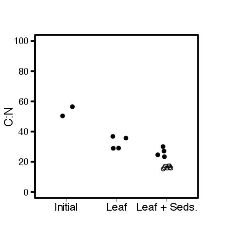
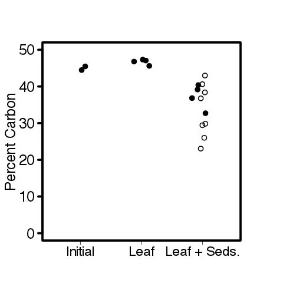
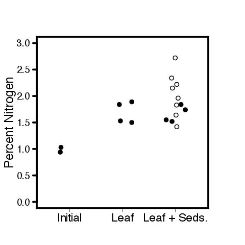

# Analysis of the Leaf C:N data for the Leached Litter and CPOM Flux Experiment

## Fall 2015

## Metadata

* Code created 2 Feb 2016 - KF

## Purpose

This code creates calculated variables for the C:N data from the Leached Litter experiment and evaluates differences in the treatments

## Code
### Import Data
    
    #leached litter exp
    cn.ll <- read.table("./data/leached_litter_CN.csv", header = T, sep = ",")

    # CPOM Flux exp
    cn.cf <- read.table("./data/CPOM_Flux_CN.csv", header = T, sep = ",")

### Remove the QA QC repeat analyses from leached litter data

    cn.ll <- cn.ll[cn.ll$Repeat == "N", ]

## Data Analysis
### Effect of Treament on CN

#### Data Summary

    tapply(cn.ll$CN[cn.ll$Type == "Leaf"], cn.ll$Treat[cn.ll$Type == "Leaf"], summary)

~~~~
# CN of Leaves
$I
   Min. 1st Qu.  Median    Mean 3rd Qu.    Max. 
  50.39   51.91   53.43   53.43   54.95   56.47 

$L
   Min. 1st Qu.  Median    Mean 3rd Qu.    Max. 
  28.93   29.03   32.38   32.63   35.98   36.82 

$LS
   Min. 1st Qu.  Median    Mean 3rd Qu.    Max. 
  23.36   24.31   25.86   26.29   27.84   30.07 

~~~~

#### Test of treatment effect
 
    cn.leaf.anova <- aov(CN ~ Treat, data = cn.ll, subset = Type == "Leaf")
    summary(cn.leaf.anova)

~~~~
 
> summary(cn.leaf.anova)
            Df Sum Sq Mean Sq F value   Pr(>F)    
Treat        2  999.9   499.9    35.7 0.000213 ***
Residuals    7   98.0    14.0   

~~~~

##### Tukey Test
 
     TukeyHSD(cn.leaf.anova)

~~~~
 
> TukeyHSD(cn.leaf.anova)
  Tukey multiple comparisons of means
    95% family-wise confidence level

Fit: aov(formula = CN ~ Treat, data = cn.ll, subset = Type == "Leaf")

$Treat
           diff       lwr        upr     p adj
L-I  -20.802835 -30.34787 -11.257802 0.0009063
LS-I -27.142178 -36.68721 -17.597146 0.0001725
LS-L  -6.339343 -14.13283   1.454143 0.1063607

~~~~
 
#### Plot
    
    par(las = 1)
    plot(CN ~ jitter(as.numeric(Treat), 1), data = cn.ll, subset = Type == "Leaf", ylim = c(0, 100), xlim = c(0, 4), axes = F, xlab = " ")
    axis(2)
    axis(1, c("Initial", "Leaf", "Leaf + Sed."), at = c(1, 2, 3))
    box()
    points(jitter(rep(3, 8), 1), cn.cf$CN[cn.cf$Source == "leaf"], pch = 3)
    dev.copy(jpeg, "./output/plots/cn_leaf_by_treatment.jpg")
    dev.off()

FIGURE Plot of the C:N of the leaf organic matter by the treatment conditions in the bottle. Initial refers to leaf samples before being added to the bottles. Leaf refers to leaves that were incubated with only lake water, and Leaf + Seds refers to leaves that were incubated with lake water and sediment. The open circles are from the leached litter experiment and the crosses are from the CPOM Flux experiment. Each point is from the homgenized leaves from a single bottle.

#### Interpretation of CN

Overall the CN of the leaves declined following incubation. The greater decline in the CPOM Flux experiment is interesting and may be related to the fact that the leaves were not initially leached prior to that experiment. 

Unfortunately I do not know the initial CN of the leaves from that experiment.

### Effect of Treament on percent C
#### Data Summary

    tapply(cn.ll$percC[cn.ll$Type == "Leaf"], cn.ll$Treat[cn.ll$Type == "Leaf"], summary)

~~~~
# percC of Leaves
$I
   Min. 1st Qu.  Median    Mean 3rd Qu.    Max. 
  44.47   44.72   44.97   44.97   45.23   45.48 

$L
   Min. 1st Qu.  Median    Mean 3rd Qu.    Max. 
  45.61   46.50   46.93   46.70   47.13   47.32 

$LS
   Min. 1st Qu.  Median    Mean 3rd Qu.    Max. 
  32.71   35.80   37.99   37.27   39.47   40.39 

~~~~

#### Test of treatment effect
 
    percC.leaf.anova <- aov(percC~ Treat, data = cn.ll, subset = Type == "Leaf")
    summary(percC.leaf.anova)

~~~~
 
> summary(percC.leaf.anova)
            Df Sum Sq Mean Sq F value  Pr(>F)   
Treat        2 191.97   95.98    18.4 0.00163 **
Residuals    7  36.52    5.22 

~~~~

##### Tukey Test
 
     TukeyHSD(percC.leaf.anova)

~~~~
> TukeyHSD(percC.leaf.anova)
  Tukey multiple comparisons of means
    95% family-wise confidence level

Fit: aov(formula = percC ~ Treat, data = cn.ll, subset = Type == "Leaf")

$Treat
        diff        lwr       upr     p adj
L-I   1.7225  -4.103199  7.548199 0.6742029
LS-I -7.7025 -13.528199 -1.876801 0.0143574
LS-L -9.4250 -14.181663 -4.668337 0.0015993

~~~~
 
#### Plot
 
    par(las = 1)
    plot(percC ~ jitter(as.numeric(Treat), 1), data = cn.ll, subset = Type == "Leaf",    ylim = c(0, 50), xlim = c(0, 4), xlab = " ", axes = F)
    axis(2)
    axis(1, c("Initial", "Leaf", "Leaf + Seds."), at = c(1, 2, 3))
    box()
    points(jitter(rep(3, 8), 1), cn.cf$percC[cn.cf$Source == "leaf"], pch = 3)
    dev.copy(jpeg, "./output/plots/percC_leaf_by_treatment.jpg")
    dev.off()

FIGURE Plot of the percent C (percC) of the leaf organic matter by the treatment conditions in the bottle. Initial refers to leaf samples before being added to the bottles. Leaf refers to leaves that were incubated with only lake water, and Leaf + Seds refers to leaves that were incubated with lake water and sediment. The open circles are from the leached litter experiment and the crosses are from the CPOM Flux experiment. Each point is from the homgenized leaves from a single bottle.

#### Interpretation of percent C

There is no difference in the CN of the leaves incubated with and without leaf sediments but the leaves incubated with sediments have lower percent C. One possibility is that this is due to sediment material that is stuck to the leaves, or it could be due to the greater mineralization of C from the leaves in the sediment environment.

### Effect of Treament on percent N
#### Data Summary

    tapply(cn.ll$percN[cn.ll$Type == "Leaf"], cn.ll$Treat[cn.ll$Type == "Leaf"], summary)

~~~~
# percC of Leaves
$I
   Min. 1st Qu.  Median    Mean 3rd Qu.    Max. 
 0.9400  0.9625  0.9850  0.9850  1.0070  1.0300 

$L
   Min. 1st Qu.  Median    Mean 3rd Qu.    Max. 
  1.500   1.522   1.685   1.690   1.852   1.890 

$LS
   Min. 1st Qu.  Median    Mean 3rd Qu.    Max. 
  1.520   1.542   1.645   1.662   1.765   1.840 

~~~~

#### Test of treatment effect
 
    percN.leaf.anova <- aov(percN~ Treat, data = cn.ll, subset = Type == "Leaf")
    summary(percN.leaf.anova)

~~~~
 
> summary(percN.leaf.anova)
            Df Sum Sq Mean Sq F value  Pr(>F)   
Treat        2 0.7660  0.3830   13.49 0.00397 **
Residuals    7 0.1987  0.0284  

~~~~

##### Tukey Test
 
     TukeyHSD(percN.leaf.anova)

~~~~

> TukeyHSD(percN.leaf.anova)
  Tukey multiple comparisons of means
    95% family-wise confidence level

Fit: aov(formula = percN ~ Treat, data = cn.ll, subset = Type == "Leaf")

$Treat
        diff       lwr      upr     p adj
L-I   0.7050  0.275264 1.134736 0.0046766
LS-I  0.6775  0.247764 1.107236 0.0058038
LS-L -0.0275 -0.378378 0.323378 0.9711771

~~~~

#### Plot
 
    par(las = 1)     
    plot(percN ~ jitter(as.numeric(Treat), 1), data = cn.ll, subset = Type == "Leaf", ylim = c(0, 3), xlim = c(0, 4), xlab = " ", axes = F)
    axis(2)
    axis(1, c("Initial", "Leaf", "Leaf + Seds."), at = c(1, 2, 3))
    box()
    points(jitter(rep(3, 8), 1), cn.cf$percN[cn.cf$Source == "leaf"], pch = 3)
    dev.copy(jpeg, "./output/plots/percN_leaf_by_treatment.jpg")
    dev.off()

FIGURE Plot of the percent N (percN) of the leaf organic matter by the treatment conditions in the bottle. Initial refers to leaf samples before being added to the bottles. Leaf refers to leaves that were incubated with only lake water, and Leaf + Seds refers to leaves that were incubated with lake water and sediment. The open circles are from the leached litter experiment and the crosses are from the CPOM Flux experiment. Each point is from the homgenized leaves from a single bottle.

#### Interpretation of percent N

Unlike for the percent C, the percent N of the leaves increased from the initial regardless of whether they were incubated with sediments or not. 

### Leaf Analysis for CPOM Flux

#### Effect of nutrient addition on leaf litter

There was no effect of the nutrient addition on the leaf litter CN, perc C, or perc N

    plot(CN ~ jitter(as.numeric(NUT), 1), data = cn.cf, subset = Source == "leaf", ylim = c(0, 25), axes = F, xlab = " ")
    axis(2)
    axis(1, c("Ambient Nutrients", "Added Nutrients"), at = c(1, 2))

    plot(percC~ jitter(as.numeric(NUT), 1), data = cn.cf, subset = Source == "leaf", ylim = c(0, 50), axes = F, xlab = " ")
    axis(2)
    axis(1, c("Ambient Nutrients", "Added Nutrients"), at = c(1, 2))

    plot(percN~ jitter(as.numeric(NUT), 1), data = cn.cf, subset = Source == "leaf", ylim = c(0, 3), axes = F, xlab = " ")
    axis(2)
    axis(1, c("Ambient Nutrients", "Added Nutrients"), at = c(1, 2))

#### Relationship between perc C and perc N

Interestingly there is a positive correlation between the perc N and perc C of the leaves in the CPOM Flux experiment.

    summary(lm(percN ~ percC, data = cn.cf, subset = Source == "leaf"))

~~~~
 
> summary(lm(percN ~ percC, data = cn.cf, subset = Source == "leaf"))

Call:
lm(formula = percN ~ percC, data = cn.cf, subset = Source == 
    "leaf")

Residuals:
     Min       1Q   Median       3Q      Max 
-0.09441 -0.07635 -0.01631  0.04021  0.15532 

Coefficients:
            Estimate Std. Error t value Pr(>|t|)    
(Intercept) 0.192349   0.182179   1.056    0.332    
percC       0.055196   0.005347  10.322 4.83e-05 ***

Residual standard error: 0.1029 on 6 degrees of freedom
Multiple R-squared:  0.9467, Adjusted R-squared:  0.9378 
F-statistic: 106.6 on 1 and 6 DF,  p-value: 4.832e-05

~~~~
    
    par(las = 1)
    plot(percN ~ percC, data = cn.cf, subset = Source == "leaf", main = "CPOM Flux Exp")
    dev.copy(jpeg, "./output/plots/percC_by_percN_CPOM_Flux.jpg")
    dev.off()

FIGURE: The relationship between percent C (percC) and percent N (percN) of the leaves in the CPOM Flux Experiment. Each point represents the homogenized leaves from a single bottle.

This correlation was not found in the Leached Litter Experiment

    summary(lm(percN ~ percC, data = cn.ll, subset = Type == "Leaf"))

~~~~
 
 Call:
lm(formula = percN ~ percC, data = cn.ll, subset = Type == "Leaf")

Residuals:
     Min       1Q   Median       3Q      Max 
-0.56442 -0.09125  0.02883  0.22063  0.40401 

Coefficients:
            Estimate Std. Error t value Pr(>|t|)  
(Intercept)  2.03157    0.96865   2.097   0.0692 .
percC       -0.01159    0.02261  -0.513   0.6220  

Residual standard error: 0.3417 on 8 degrees of freedom
Multiple R-squared:  0.03182, Adjusted R-squared:  -0.08921 
F-statistic: 0.2629 on 1 and 8 DF,  p-value: 0.622

~~~~
    
    par(las = 1)
    plot(percN ~ percC, data = cn.ll, subset = Type == "Leaf", main = "Leached Litter Exp")
    dev.copy(jpeg, "./output/plots/percC_by_percN_leached_litter.jpg")
    dev.off()

FIGURE: The relationship between percent C (percC) and percent N (percN) of the leaves in the Leached Litter. Each point represents the homogenized leaves from a single bottle.
