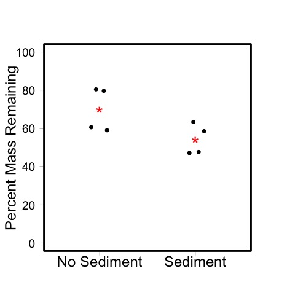

# Analysis of the LOI from the leached litter exp. 

## Fall 2015

## Metadata

* Code created 2 Feb 2016 - KF

* Modfied - 9 Aug 2016 - KF - expanded the analysis to include the sediments as well as the leaves.

## Purpose

This code analyzes the LOI data from the Leached Litter experiment and evaluates differences in the treatments

## Code
### Import Data

    loi <- read.table("./data/leached_litter_LOI_5nov2015.csv", header = T, sep = ",")
    loi.init <- read.table("./data/leached_litter_initial_LOI_17Sept2015.csv", header = T, sep = ",")

### Compare Leaf Mass Loss
    
    initial.leaf.mean <- (mean(loi$AFDM.leaf[loi$treat == "PRE"]))
    
    mass.loss <- initial.leaf.mean - loi$AFDM.leaf[loi$sample == "leaf"]
    perc.mass.rem <- (1 - (mass.loss / initial.leaf.mean)) * 100
    
    #remove the PRE samples
    mass.loss <- mass.loss[1:8]
    perc.mass.rem <- perc.mass.rem[1:8]

#### Summary by Treatment

    tapply(mass.loss, loi$treat[loi$sample == "leaf" & loi$treat != "PRE"], summary)

~~~~
# mass loss of a single leaf over the duration of the experiment (g)

$L
     Min.   1st Qu.    Median      Mean   3rd Qu.      Max. 
0.0004200 0.0004325 0.0006408 0.0006450 0.0008533 0.0008783 

$LS
     Min.   1st Qu.    Median      Mean   3rd Qu.      Max. 
0.0007867 0.0008637 0.0010060 0.0009832 0.0011260 0.0011340 

~~~~

    tapply(perc.mass.rem, loi$treat[loi$sample == "leaf" & loi$treat != "PRE"], summary)
 
~~~~
# Percent Mass Remaining of a Single Leaf after the duration of the experiment

$L
   Min. 1st Qu.  Median    Mean 3rd Qu.    Max. 
  59.05   60.22   70.12   69.93   79.84   80.42 

$LS
   Min. 1st Qu.  Median    Mean 3rd Qu.    Max. 
  47.14   47.53   53.10   54.16   59.73   63.33 
~~~~

 
    tapply((100 - perc.mass.rem), loi$treat[loi$sample == "leaf" & loi$treat != "PRE"], summary)

    tapply((100 - perc.mass.rem), loi$treat[loi$sample == "leaf" & loi$treat != "PRE"], sd)

~~~~
# Percent AFDM Mass lost from a single leaf during the experiment in the treatments
 
$L
   Min. 1st Qu.  Median    Mean 3rd Qu.    Max. 
  19.58   20.16   29.88   30.07   39.78   40.95 

$LS
   Min. 1st Qu.  Median    Mean 3rd Qu.    Max. 
  36.67   40.27   46.90   45.84   52.47   52.86 

$PRE
NULL

$S
NULL

## SD

       L       LS      PRE        S 
11.68519  8.05707       NA       NA 

~~~~
 
### Test Treatment Effect on the mass loss of the leaves

    # Create treatment vector
    treatment <- loi$treat[loi$sample == "leaf" & loi$treat != "PRE"]    
    treatment <- as.numeric(treatment)
    
    anova(lm(perc.mass.rem ~ as.factor(treatment)))
     
     
~~~~
      
Analysis of Variance Table

Response: perc.mass.rem
                     Df Sum Sq Mean Sq F value  Pr(>F)  
as.factor(treatment)  1 497.17  497.17  4.9357 0.06804 .
Residuals             6 604.38  100.73

~~~~

#### Plots

    par(las = 1, mar = c(5, 5, 5, 5), lwd = 2)
    plot(perc.mass.rem ~ jitter(treatment, 0.5), ylim = c(0, 100), xlim = c(0.5, 2.5), axes = F, xlab = " ", ylab = "Percent Mass Remaining", cex.lab = 1.5, pch = 19)
    axis(2, cex.axis = 1.2)
    axis(1, c("No Sediment", "Sediment"), at = c(1, 2), cex.axis = 1.5)
    box(lwd = 5)
    text(1, mean(perc.mass.rem[treatment == 1]), "*", cex = 2, col = "red")
    text(2, mean(perc.mass.rem[treatment == 2]), "*", cex = 2, col = "red")
    dev.copy(jpeg, "./output/plots/perc_mass_rem_by_treatment.jpg")
    dev.off()

FIGURE: Plot of the percent leaf mass remaining by the presence of sediment in the bottles in the Leached Litter Experiment. Each point represents the average mass loss of a single leaf estimated from the change in mass of all of the leaves in the bottle. The red star indicates the mean.

### Sediment LOI

Summarize the percent organic matter at the end of the experiment

    tapply(loi$propOM[loi$sample == "sed"], loi$treat[loi$sample == "sed"], summary)

~~~~
# The proportion of organic matter in the sediments of the different treatments at the conclusion of the experiment.

$L
NULL

$LS
   Min. 1st Qu.  Median    Mean 3rd Qu.    Max. 
 0.1181  0.1212  0.1238  0.1265  0.1291  0.1403 

$PRE
NULL

$S
   Min. 1st Qu.  Median    Mean 3rd Qu.    Max. 
 0.1312  0.1319  0.1334  0.1709  0.1725  0.2857 

~~~~
