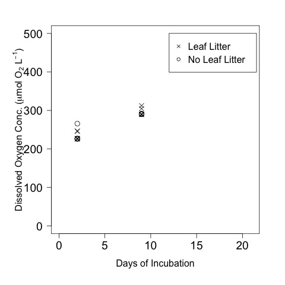
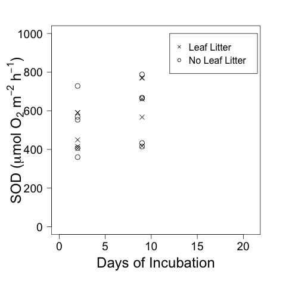

# Analysis of the SOD calcualtions from the Spring Leached Litter Exp 

## Spring 2016

## Metadata

* Code created 17 May 2016

* 16 Aug 2016 - KF - added calculations of DO concentration 

## Purpose

This code is to analyze the effect of the leached litter addition treatments on SOD. 

## Code
### Import Data

Flux calculations can be found in [leached_litter_Spring_sod_calc_11feb2016.md](https://github.com/KennyPeanuts/CPOM_Flux/blob/master/lab_notebook/analysis/leached_litter_Spring_sod_calc_11feb2016.md) and [leached_litter_Spring_sod_calc_18feb2016.md](https://github.com/KennyPeanuts/CPOM_Flux/blob/master/lab_notebook/analysis/leached_litter_Spring_sod_calc_18feb2016.md)

    sod_11feb <- read.table("./data/leached_litter_sp_sod_calculation_11feb2016.csv", header = T, sep = ",")
    sod_18feb <- read.table("./data/leached_litter_sp_sod_calculation_18feb2016.csv", header = T, sep = ",")

### Combine into a single dataset

    sod <- rbind(sod_11feb, sod_18feb)
    
#### Create a date and incubation day variable

    date <- c(rep("2016-02-11", 10), rep("2016-02-18", 10))
    # the incubation was begun on 9 Feb 2016
    days.elap <- c(rep(2, 10), rep(9, 10))

#### Create as single combined data.frame

    sod <- data.frame(date, days.elap, sod)

#### Normalize the SOD by organic matter content
##### Import LOI data

These data still need to be entered - KF - 16 Aug 2016
 
    #loi <- read.table("./data/

## Analysis
### Analyze DO concentrations

    tapply(sod$DO.T0, sod$days.elap, summary) 
    tapply(sod$DO.T0, sod$days.elap, sd)

~~~~
Dissolved oxygen in the bottles (mmol /L) by days elapsed

$`2`
   Min. 1st Qu.  Median    Mean 3rd Qu.    Max. SD
 0.2253  0.2264  0.2271  0.2344  0.2410  0.2657 0.013698528

$`9`
   Min. 1st Qu.  Median    Mean 3rd Qu.    Max. SD
 0.2890  0.2900  0.2908  0.2940  0.2915  0.3124 0.007928689

~~~~
 
    anova(lm(DO.T0 ~ treatment * days.elap, data = sod))

~~~~
ANOVA on the DO conc of the bottles by time and treatment

Analysis of Variance Table

Response: DO.T0
                    Df    Sum Sq   Mean Sq  F value    Pr(>F)    
treatment            1 0.0000522 0.0000522   0.3883    0.5420    
days.elap            1 0.0177844 0.0177844 132.3840 3.775e-09 ***
treatment:days.elap  1 0.0000530 0.0000530   0.3947    0.5387    
Residuals           16 0.0021494 0.0001343                       
---
 
~~~~
 
#### Plot of the DO concentration of the bottles by time and treatment
    
    par(las = 1, mar = c(6, 6, 3, 3))
    plot(DO.T0 ~ days.elap, data = sod, subset = treatment == "LS", ylim = c(0, 0.5), xlim = c(0, 21), xlab = "Days of Incubation", ylab = expression(paste("Dissolved Oxygen Conc. (mmol ", O[2], " L"^{-1}, ")")), pch = 4, cex.axis = 1.2, cex.lab = 1, cex = 1.5)
    points(DO.T0 ~ days.elap, data = sod, subset = treatment == "S", pch = 1, cex = 1.5)
    legend(12, 0.5, c("Leaf Litter", "No Leaf Litter"), pch = c(4, 1), cex = 1)
    dev.copy(jpeg, "./output/plots/leached_litter_DO_by_days.jpg")
    dev.off()

Dissolved Oxygen by days elapsed for bottles with and without leaf litter

### Plot Effect of Treatment on Area Norm SOD    
    par(las = 1, mar = c(6, 6, 3, 3))
    plot(SOD ~ days.elap, data = sod, subset = treatment == "LS", ylim = c(0, 2.5), xlim = c(0, 21), xlab = "Days of Incubation", ylab = expression(paste("SOD (mmol ", O[2], " m"^{-2}, " h"^{-1}, ")")), pch = 4, cex.axis = 1.2, cex.lab = 1.5, cex = 1.5)
    points(SOD ~ days.elap, data = sod, subset = treatment == "S", pch = 1, cex = 1.5)
    legend(12, 2.5, c("Leaf Litter", "No Leaf Litter"), pch = c(4, 1), cex = 1)
    dev.copy(jpeg, "./output/plots/leached_litter_SOD_by_days.jpg")
    dev.off()

Area normalized SOD by days elapsed for bottles with and without leaf litter

