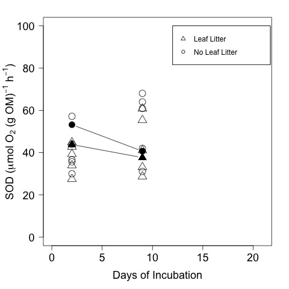

# Analysis of the SOD calcualtions from the Spring Leached Litter Exp 

## Spring 2016

## Metadata

* Code created 17 May 2016

* 16 Aug 2016 - KF - added calculations of DO concentration 

* 17 Aug 2016 - KF - converted DO to umol/L to match litter exp results

* 19 Aug 2016 - KF - normalized SOD by LOI 

* 22 Aug 2016 - KF - Performed repeated measures analysis of LOI normalized and area normalized data

* 23 Aug 2016 - KF - Added summary information on SOD

## Purpose

This code is to analyze the effect of the leached litter addition treatments on SOD. 

## Code
### Import Data

Flux calculations can be found in [leached_litter_Spring_sod_calc_11feb2016.md](https://github.com/KennyPeanuts/CPOM_Flux/blob/master/lab_notebook/analysis/leached_litter_Spring_sod_calc_11feb2016.md) and [leached_litter_Spring_sod_calc_18feb2016.md](https://github.com/KennyPeanuts/CPOM_Flux/blob/master/lab_notebook/analysis/leached_litter_Spring_sod_calc_18feb2016.md)

    sod_11feb <- read.table("./data/leached_litter_sp_sod_calculation_11feb2016.csv", header = T, sep = ",")
    sod_18feb <- read.table("./data/leached_litter_sp_sod_calculation_18feb2016.csv", header = T, sep = ",")

### Combine into a single dataset

    sod <- rbind(sod_11feb, sod_18feb)
    
#### Create a date and incubation day variable

    date <- c(rep("2016-02-11", 10), rep("2016-02-18", 10))
    # the incubation was begun on 9 Feb 2016
    days.elap <- c(rep(2, 10), rep(9, 10))

#### Create as single combined data.frame

    sod <- data.frame(date, days.elap, sod)

#### Normalize the SOD by organic matter content
##### Import LOI data

    loi <- read.table("./data/leached_litter_Spring_LOI_sp2016.csv", header = T, sep = ",")

##### Remove the initial data

    loi.final <- loi[loi$time == "final", ]

##### Calculate the total organic matter in the bottle

To to this I need to split out the leaf and sediment data and then merge it by BOD bottle

    leaf.AFDM <- loi.final$AFDM.leaf[loi.final$sample == "leaf"]
    leaf.bod <- loi.final$bod[loi.final$sample == "leaf"]

    leaf.OM <- data.frame(leaf.bod, leaf.AFDM)
    names(leaf.OM) <- c("bod", "leaf.AFDM")

    #data frame with a new column of the leaf AFDM
    loi.final.tot <- merge(loi.final, leaf.OM, by = "bod")
    loi.final.sed <- loi.final.tot[loi.final.tot$sample == "sed", ]
    
Now that I have a data frame (`loi.final.tot`) that has the leaf.AFDM and sediment AFDM in different columns, I can add them for the LS bottles

     AFDM.tot.LS <- loi.final.sed$AFDM.sample + loi.final.sed$leaf.AFDM

##### Create data frame of the total organic matter and the BOD number to merge with the SOD data

    LS.OM <- data.frame(loi.final.sed$bod, AFDM.tot.LS)
    names(LS.OM) <- c("bod", "AFDM.tot")

    S.OM <- data.frame(loi.final$bod[loi.final$treatment == "S"], loi.final$AFDM.sample[loi.final$treatment == "S"])
    names(S.OM) <- c("bod", "AFDM.tot")
    
    OM.tot <- rbind(S.OM, LS.OM)

The `OM.tot` data frame contains the total organic matter (leaf + sediment) (g AFDM) for each of the BOD bottles.

##### Merge the total OM to the SOD data

    sod.om <- merge(sod, OM.tot, by = "bod")

## Analysis

#### Convert DO from mmol/L to umol/L

    DO.T0.umol <- sod$DO.T0 * 1000

### Analyze DO concentrations

    tapply(DO.T0.umol, sod$days.elap, summary) 
    tapply(DO.T0.umol, sod$days.elap, sd)

~~~~
Dissolved oxygen in the bottles (umol /L) by days elapsed

$`2`
   Min. 1st Qu.  Median    Mean 3rd Qu.    Max. SD
  225.3   226.4   227.1   234.4   241.0   265.7 13.698528 

$`9`
   Min. 1st Qu.  Median    Mean 3rd Qu.    Max. SD
  289.0   290.0   290.8   294.0   291.5   312.4 7.928689

~~~~

    tapply(DO.T0.umol, sod$treatment, summary) 
    tapply(DO.T0.umol, sod$treatment, sd)

~~~~
Dissolved oxygen in the bottles (umol/L) by treatment

$LS
   Min. 1st Qu.  Median    Mean 3rd Qu.    Max. SD
  225.3   231.9   267.8   265.8   290.4   312.4 34.65816

$S
   Min. 1st Qu.  Median    Mean 3rd Qu.    Max. SD
  226.1   226.7   277.8   262.6   290.8   291.7 31.93086

~~~~~
 
 
#### Plot of the DO concentration of the bottles by time and treatment
    
    par(las = 1, mar = c(6, 6, 3, 3))
    plot(DO.T0.umol ~ days.elap, data = sod, subset = treatment == "LS", ylim = c(0, 500), xlim = c(0, 21), xlab = "Days of Incubation", ylab = expression(paste("Dissolved Oxygen Conc. (", mu, "mol ",O[2], " L"^{-1}, ")")), pch = 4, cex.axis = 1.2, cex.lab = 1, cex = 1.5)
    points(DO.T0.umol ~ days.elap, data = sod, subset = treatment == "S", pch = 1, cex = 1.5)
    legend(12, 500, c("Leaf Litter", "No Leaf Litter"), pch = c(4, 1), cex = 1)
    dev.copy(jpeg, "./output/plots/leached_litter_DO_by_days.jpg")
    dev.off()

Dissolved Oxygen by days elapsed for bottles with and without leaf litter

### Area Normalized SOD
#### Summary of Area Normalized SOD

    summary(sod.om$SOD * 1000) # the multiplication by 1000 is to convert to umol
    sd(sod.om$SOD * 1000) 

~~~~
Summary of Area Normalized SOD across all bottles (umol O2 / m2 / h)

Min. 1st Qu.  Median    Mean 3rd Qu.    Max.     SD
  360.3   417.2   567.9   561.3   665.4   788.4  141.5882

~~~~

    tapply((sod.om$SOD * 1000), sod.om$treatment, summary)
    tapply((sod.om$SOD * 1000), sod.om$treatment, sd)

~~~~
Summary of Area Normalized SOD by treatment (umol O2 / m2 / h)

$LS
   Min. 1st Qu.  Median    Mean 3rd Qu.    Max. SD
  405.1   425.7   578.7   563.7   643.2   771.9 140.4408

$S
   Min. 1st Qu.  Median    Mean 3rd Qu.    Max. SD
  360.3   419.9   561.0   558.8   667.0   788.4 150.2825 

~~~~
    
#### Plot Effect of Treatment on Area Norm SOD    
    par(las = 1, mar = c(6, 6, 3, 3))
    plot(SOD * 1000 ~ days.elap, data = sod.om, subset = treatment == "LS", ylim = c(0, 1000), xlim = c(0, 21), xlab = "Days of Incubation", ylab = expression(paste("SOD (", mu, "mol ", O[2], " m"^{-2}, " h"^{-1}, ")")), pch = 4, cex.axis = 1.2, cex.lab = 1.5, cex = 1.5)
    points(SOD * 1000 ~ days.elap, data = sod.om, subset = treatment == "S", pch = 1, cex = 1.5)
    legend(12, 1000, c("Leaf Litter", "No Leaf Litter"), pch = c(4, 1), cex = 1)
    dev.copy(jpeg, "./output/plots/leached_litter_SOD_by_days.jpg")
    dev.off()

Area normalized SOD by days elapsed for bottles with and without leaf litter

### OM Normalized SOD

#### Normalize the change in O2 by AFDM

    dDO.OM <- sod.om$dDO / sod.om$AFDM.tot 

#### Normalize to h of incubation

    SOD.OM <- dDO.OM / sod.om$incubation.h #SOD in mmol O2 / (g AFDM) / h

#### Add to OM normalized data to sod data.frame

    sod.om <- data.frame(sod.om, SOD.OM)

### Summary of OM Normalized SOD

    summary(sod.om$SOD.OM * 1000) # multiplication by 1000 converts to umol
    sd(sod.om$SOD.OM * 1000)

~~~~
Summary of OM Normalized SOD across all microcosms (umol O2 / m2 / h)

 Min. 1st Qu.  Median    Mean 3rd Qu.    Max.   SD
  27.49   33.74   41.56   43.84   55.83   68.02 12.76679

~~~~

    tapply(sod.om$SOD.OM * 1000, sod.om$treatment, summary)
    tapply(sod.om$SOD.OM * 1000, sod.om$treatment, sd)

~~~~
Summary of OM Normalized SOD by treatment (umol O2 / m2 / h)

$LS
   Min. 1st Qu.  Median    Mean 3rd Qu.    Max. SD
  30.02   35.90   42.99   46.95   59.99   68.02 14.29411 

$S
   Min. 1st Qu.  Median    Mean 3rd Qu.    Max. SD
  27.49   33.30   40.20   40.74   44.29   60.82 10.87750 

~~~~
 
 
### Repeated measures analysis of the OM normalized SOD

#### Load the `lmerTest` package

    library("lmerTest", lib.loc="~/Library/R/3.1/library")  

#### Specify Model

I am using `bod` as the random subject variable.

I changed the model specification from `(days.elap|bod)` to `(1|bod)` because I was getting the error in this Cross Validated question: [http://stats.stackexchange.com/questions/140038/lme4-random-effects](http://stats.stackexchange.com/questions/140038/lme4-random-effects)

    (fm <- lmer(SOD.OM ~ 1 + days.elap * treatment + (1|bod), sod.om))

~~~~
 Linear mixed model fit by REML ['merModLmerTest']
Formula: SOD.OM ~ 1 + days.elap * treatment + (1 | bod)
   Data: sod.om
REML criterion at convergence: -81.4431
Random effects:
 Groups   Name        Std.Dev.
 bod      (Intercept) 0.005395
 Residual             0.011042
Number of obs: 20, groups:  bod, 10
Fixed Effects:
         (Intercept)     days.elap            treatmentS  days.elap:treatmentS  
           0.0371089     0.0017893            -0.0012155            -0.0009088  

~~~~
 
    anova(fm)

~~~~
 
Analysis of Variance Table of type III  with  Satterthwaite 
approximation for degrees of freedom
                        Sum Sq    Mean Sq NumDF   DenDF F.value  Pr(>F)  
days.elap           0.00043659 0.00043659     1  8.0003  3.5808 0.09509 .
treatment           0.00000187 0.00000187     1 15.0522  0.0154 0.90304  
days.elap:treatment 0.00005058 0.00005058     1  8.0003  0.4149 0.53753  

~~~~
 
#### Plot of the OM Normalized SOD 

    par(las = 1, mar = c(6, 6, 3, 3))
    plot(SOD.OM * 1000 ~ days.elap, data = sod.om, subset = treatment == "LS", ylim = c(0, 100), xlim = c(0, 21), xlab = "Days of Incubation", ylab = expression(paste("SOD (",mu, "mol ", O[2], "(g AFDM)"^{-1}, ")")), pch = 4, cex.axis = 1.2, cex.lab = 1.5, cex = 1.5)
    points(SOD.OM * 1000 ~ days.elap, data = sod.om, subset = treatment == "S", pch = 1, cex = 1.5)
    legend(12, 100, c("Leaf Litter", "No Leaf Litter"), pch = c(4, 1), cex = 1)
    dev.copy(jpeg, "./output/plots/leached_litter_SOD.OM_by_days.jpg")
    dev.off()

Area normalized SOD by days elapsed for bottles with and without leaf litter