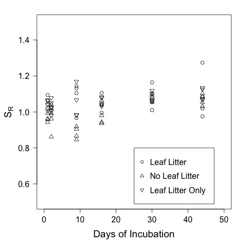

# Analysis of the spec scan results from the Leached Litter Experiment - Fall 2015

## Purpose

This code it to analyze the spec scan data from the treatments with and without leached leaf litter 

## Load Data

    Eratio <- read.table("./data/leached_litter_Eratio.csv", header = T, sep = ",")
    sratio <- read.table("./data/leached_litter_sratio.csv", header = T, sep = ",")

### Add elapsed days to Eratio

    Eratio <- data.frame(Eratio, sratio$elapsed.d)
    names(Eratio) <- c("bod", "day", "treat", "E2E3.a", "E4E6.a", "elapsed.d")

## E-ratio data
### Statistical Summary

Summary of the E2:E3 in all of the samples on all days

    summary(Eratio$E2E3.a)

~~~~

Min. 1st Qu.  Median    Mean 3rd Qu.    Max. 
2.500   3.707   4.090   4.142   4.618   6.526 
  
~~~~

### Repeated Measures Analysis
  
Requires the `lmerTest` package

    library("lmerTest", lib.loc="~/Library/R/3.1/library")

#### Specify the formula

    E2E3.mod <- lmer(E2E3.a ~ 1 + elapsed.d * treat + (1 | bod), Eratio)
    summary(E2E3.mod)

~~~~
  
Linear mixed model fit by REML t-tests use Satterthwaite approximations to degrees of  freedom
 [merModLmerTest]
Formula: E2E3.a ~ 1 + elapsed.d * treat + (1 | bod)
   Data: Eratio

REML criterion at convergence: 185.8

Scaled residuals: 
     Min       1Q   Median       3Q      Max 
-2.61885 -0.55438 -0.02343  0.42595  2.83665 

Random effects:
 Groups   Name        Variance Std.Dev.
 bod      (Intercept) 0.0000   0.0000  
 Residual             0.5708   0.7555  
Number of obs: 72, groups:  bod, 12

Fixed effects:
                   Estimate Std. Error        df t value Pr(>|t|)    
(Intercept)        4.601299   0.228789 66.000000  20.112   <2e-16 ***
elapsed.d         -0.013634   0.009941 66.000000  -1.371    0.175    
treatLS           -0.538927   0.323556 66.000000  -1.666    0.101    
treatS            -0.074585   0.323556 66.000000  -0.231    0.818    
elapsed.d:treatLS  0.006912   0.014059 66.000000   0.492    0.625    
elapsed.d:treatS  -0.011023   0.014059 66.000000  -0.784    0.436    
---
Signif. codes:  0 ‘***’ 0.001 ‘**’ 0.01 ‘*’ 0.05 ‘.’ 0.1 ‘ ’ 1

Correlation of Fixed Effects:
            (Intr) elpsd. tretLS treatS el.:LS
elapsed.d   -0.739                            
treatLS     -0.707  0.522                     
treatS      -0.707  0.522  0.500              
elpsd.d:tLS  0.522 -0.707 -0.739 -0.369       
elpsd.d:trS  0.522 -0.707 -0.369 -0.739  0.500

~~~~
  
#### Check Assumptions
  
Checking for homogeniety of variance with a plot of the residuals by the fitted

    plot(E2E3.mod)
    dev.copy(jpeg, "./output/plots/leached_litter_E2E3_resid_fitted.jpg")
    dev.off()

Overall the assumption seems to be reasonably met.

Checking for normality of the residuals with a qqnorm plot 

    qqnorm(resid(E2E3.mod))
    dev.copy(jpeg, "./output/plots/leached_litterE2E3_qqnorm_resid.jpg")
    dev.off()

#### Test for significance of Fixed Effects
  
    anova(E2E3.mod)

~~~~
  
Analysis of Variance Table of type III  with  Satterthwaite 
approximation for degrees of freedom
                Sum Sq Mean Sq NumDF DenDF F.value  Pr(>F)  
elapsed.d       3.9009  3.9009     1    66   6.834 0.01107 *
treat           1.8597  0.9299     2    66   1.629 0.20391  
elapsed.d:treat 0.9452  0.4726     2    66   0.828 0.44142  

~~~~

#### Graphical Analysis

##### Plot of means and scatterplot

Plots of E2:E3

    E2E3.CPOM.mean <- as.numeric(tapply(Eratio$E2E3[Eratio$CPOM == "yes"], Eratio$elapsed.d[Eratio$CPOM == "yes"], mean))  
    E2E3.noCPOM.mean <- as.numeric(tapply(Eratio$E2E3[Eratio$CPOM == "no"], Eratio$elapsed.d[Eratio$CPOM == "no"], mean))
    
Create elapsed day vectors offset by 1

    elapsed.d.offset1 <- Eratio$elapsed.d + 1
    elapsed.d.offset1 <- Eratio$elapsed.d + 2

     par(las = 1) 
     plot(E2E3.a ~ elapsed.d, data = Eratio, subset = treat == "L", pch = 1, xlim = c(0, 25), ylim = c(0, 10), xlab = "Days of Incubation", ylab = "DOM Quality (E2:E3)", cex = 1.1)
     points(E2E3.a ~ elapsed.d, data = Eratio, subset = treat == "S", pch = 3, cex = 1.1)
     points(E2E3.a ~ elapsed.d, data = Eratio, subset = treat == "LS", pch = 4, cex = 1.1)
     legend(10, 10, c("Leaf Litter Only", "Sediment Only", "Leaf Litter + Sediment"), pch = c(1, 2, 3))
     dev.copy(jpeg, "./output/plots/leached_litter_E2E3_scatterplot.jpg")
     dev.off()
     

## Sr data

### Statistical Summary

    summary(sratio$s.ratio)
    sd(sratio$s.ratio)

~~~~

   Min. 1st Qu.  Median    Mean 3rd Qu.    Max. SD 
 0.8455  0.9929  1.0450  1.0380  1.0810  1.2740 0.07392737

~~~~

### Repeated Measures
 
 
    sratio.mod <- lmer(s.ratio ~ 1 + elapsed.d * treat + (1 |bod), sratio)
    summary(sratio.mod)

~~~~
 
Linear mixed model fit by REML t-tests use Satterthwaite approximations to degrees of  freedom
 [merModLmerTest]
Formula: s.ratio ~ 1 + elapsed.d * treat + (1 | bod)
   Data: sratio

REML criterion at convergence: -154

Scaled residuals: 
     Min       1Q   Median       3Q      Max 
-2.08159 -0.58837 -0.03934  0.48812  3.14474 

Random effects:
 Groups   Name        Variance  Std.Dev.
 bod      (Intercept) 0.0001074 0.01036 
 Residual             0.0032359 0.05688 
Number of obs: 72, groups:  bod, 12

Fixed effects:
                    Estimate Std. Error         df t value Pr(>|t|)    
(Intercept)        1.0347077  0.0179882 31.1200000  57.521  < 2e-16 ***
elapsed.d          0.0015613  0.0007485 57.0000000   2.086 0.041468 *  
treatLS            0.0105158  0.0254392 31.1200000   0.413 0.682169    
treatS            -0.1027738  0.0254392 31.1200000  -4.040 0.000325 ***
elapsed.d:treatLS -0.0005914  0.0010585 57.0000000  -0.559 0.578571    
elapsed.d:treatS   0.0018683  0.0010585 57.0000000   1.765 0.082911 .  
---
Signif. codes:  0 ‘***’ 0.001 ‘**’ 0.01 ‘*’ 0.05 ‘.’ 0.1 ‘ ’ 1

Correlation of Fixed Effects:
            (Intr) elpsd. tretLS treatS el.:LS
elapsed.d   -0.707                            
treatLS     -0.707  0.500                     
treatS      -0.707  0.500  0.500              
elpsd.d:tLS  0.500 -0.707 -0.707 -0.354       
elpsd.d:trS  0.500 -0.707 -0.354 -0.707  0.500

~~~~
 
Test of the the significants of the fixed effects

    anova(sratio.mod)

~~~~
 
Analysis of Variance Table of type III  with  Satterthwaite 
approximation for degrees of freedom
                  Sum Sq  Mean Sq NumDF  DenDF F.value    Pr(>F)    
elapsed.d       0.068412 0.068412     1 57.000 21.1417 2.417e-05 ***
treat           0.078362 0.039181     2 31.124 12.1082 0.0001289 ***
elapsed.d:treat 0.019043 0.009521     2 57.000  2.9424 0.0607953 .

~~~~

#### Check Assumptions
 
Checking for homogeneity of variance

    plot(sratio.mod, main = "sratio.mod")
    dev.copy(jpeg, "./output/plots/leached_litter_sratio_resid_fitted.jpg")
    dev.off()

Checking for normality of residuals with qqnorm plot

    qqnorm(resid(sratio.mod), main = "sratio.mod")
    dev.copy(jpeg, "./output/plots/leached_litter_sratio_qqnorm_resid.jpg")
    dev.off()
 

### Graphical Analysis

    par(las = 1, mar = c(5, 5, 2, 2))
    plot(s.ratio ~ elapsed.d, data = sratio, subset = treat == "L", ylim = c(0.5, 1.5), pch = 1, xlab = "Days of Incubation", ylab = expression(paste("S"[R])), cex.lab = 1.5, cex.axis = 1.3, cex = 1.5)
    points(s.ratio ~ elapsed.d, data = sratio, subset = treat == "S", pch = 3, cex = 1.5)
    points(s.ratio ~ elapsed.d, data = sratio, subset = treat == "LS", pch = 4, cex = 1.5)
    legend(10, 1.5, c("Leaf Litter Only", "Sediment Only", "Leaf Litter + Sediment"), pch = c(1, 3, 4), cex =1)
    dev.copy(jpeg, "./output/plots/leached_litter_sratio_by_days.jpg")
    dev.off()

